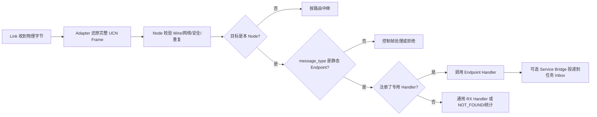

# Endpoint 与业务消息分发

> 文档级别：`NORMATIVE`
> 实现状态：`CURRENT`
> 事实源：`include/ucn/ucn_endpoint.h`、`include/ucn/ucn_node.h`、`include/ucn/ucn_service.h`、`src/core/ucn_endpoint.c`、`src/service/ucn_service_bridge.c`
> 最近核对：`a093862`，2026-08-26

## 1. Endpoint 解决的是什么问题

Node ID 只能回答“数据要到哪一台节点”。但一台 MCU 上往往同时运行 IMU 采集、气压计、温度、舵机控制、参数管理和诊断等多个业务；它们虽然共享同一条网络路径，却不能共享同一个无类型字节流。

UCN 用 Endpoint 回答第二个问题：

> 数据到达目标 Node 后，应交给哪个业务，以及该业务如何解释 Payload。

因此，一个完整业务地址是 `目标 Node ID + Endpoint`。同一节点的 IMU 和舵机命令使用不同 Endpoint，但路由仍然只需找到同一个目标 Node，不需要为每个传感器建立一套路由。

## 2. 静态 Endpoint 编号域

当前静态业务 Endpoint 范围是 `0x40..0xBF`。Endpoint 直接复用 Core Frame 的 `message_type` 字段，所以不会为业务寻址额外增加线开销。

`0x40..0xBF` 只是 UCN 预留给产品业务的编号空间，UCN 不替产品定义其中每个数字的含义。产品必须冻结自己的 Endpoint ABI，例如：

| Endpoint | 产品语义示例 | Payload 版本 | 推荐流量类 |
| --- | --- | --- | --- |
| `0x40` | IMU sample | v1 | Q1 |
| `0x41` | Barometer sample | v1 | Q1 |
| `0x42` | Temperature sample | v1 | Q1 |
| `0x60` | Servo command | v2 | Q0 |
| `0x61` | Servo result | v1 | Q0～Q3 中由产品明确冻结一种语义 |

每个产品 Endpoint 表至少还要写清：

- Payload 的字节序、长度与版本；
- 每个字段的单位、比例和有效范围；
- 是否允许远端访问；
- 允许 Q0～Q3 中的哪一种；
- 是否必须经过安全校验、命令去重或业务授权；
- 请求与结果如何关联，超时由谁管理。

如果这些内容没有冻结，即便网络能够正确把字节送到目标节点，两个固件仍可能以不同单位或结构解释同一 Payload。

## 3. 从远端帧到业务 Handler 的完整流程



关键顺序不能颠倒：Endpoint Handler 只能看到已经完成 Core 结构、目标、重复和安全边界检查的帧。业务层不应该再次自行解析物理 Carrier，也不能绕开 Node Core 直接相信 UART/CAN/Wi-Fi 收到的原始字节。

## 4. 直接使用 Node Endpoint API

低层或不使用 Service Router 的产品可以直接注册 Handler：

```c
static void imu_rx(void *context, const ucn_frame_t *frame)
{
    app_t *app = (app_t *)context;
    /* 先验证产品 Payload 版本与长度，再读取字段。 */
    app_handle_imu(app, frame->payload, frame->payload_length);
}

ucn_result_t rc = ucn_node_set_endpoint_handler(
    &node, (ucn_endpoint_t)0x40U, imu_rx, &app);
```

发送端使用 `ucn_node_send_endpoint()`：

```c
rc = ucn_node_send_endpoint(&node,
                            remote_node_id,
                            (ucn_endpoint_t)0x40U,
                            UCN_TRAFFIC_Q1_REALTIME,
                            payload,
                            payload_length);
```

`UCN_OK` 表示当前 API 所承诺的本地接受边界已经成功，不等于目标任务已经执行完成。业务如果需要“舵机已执行”之类的结果，必须由远端业务通过 Result Endpoint 显式返回。

## 5. 本机任务与远端任务为什么共用 Endpoint 语义

Service Router 让同一套业务代码面对本机和远端目标时使用一致的 `Node + Endpoint + Traffic Class + Payload` 语义：

- 目标是本机：复制到固定大小的本地 Inbox，走 Local Fast Path；
- 目标是远端：复制到固定 Remote TX Queue，由 Protocol Owner/Bridge 交给 Node；
- 接收远端消息：Node Handler 交给 Bridge，再写入目标 Service Inbox。

本机任务通信不会先编码成 Wire Frame 再绕一遍物理 Link。这样既保留统一 API，又避免把本地实时通信拖入路由、CRC 和驱动开销。

一个 Endpoint 在当前 Service Router 中只有一个本地 Owner。这样可以明确数据由哪个任务消费，避免两个任务竞争读取同一命令。需要发布/订阅或多订阅者语义时，应在产品业务层建立 Fan-out，而不是隐式让多个 Owner 抢同一个 Inbox。

## 6. Q0 FIFO 与 Q1 Latest 的分发差异

Service Binding 冻结每个 Endpoint 的 Delivery Mode：

| 模式 | 适用业务 | 队列行为 | 满载含义 |
| --- | --- | --- | --- |
| `Q0_FIFO` | 控制命令、必须按顺序处理的事件 | 每条消息占一个固定槽，先进先出 | 返回背压，不能静默覆盖旧命令 |
| `Q1_LATEST` | IMU、温度、姿态等状态流 | 未消费旧样本可被新样本替换 | 保留最新状态并增加 overwrite 统计 |

例如 IMU 以 1 kHz 产生样本，而消费任务短暂忙了 5 ms。Q1 Latest 不积压 5 个已经过时的姿态样本，而让任务醒来后读取当前最新值。舵机“打开→关闭”两条命令则不能用 Latest，否则“打开”可能被覆盖，必须使用 Q0 FIFO 或产品事务状态机。

## 7. Binding、Ready 与生命周期

`ucn_service_binding_t` 冻结每个 Endpoint 的 Owner、最大 Payload、允许的 Traffic Class、本地 Source ACL、是否接收远端消息和远端 Q0 Validator 要求。Binding 表是借用的只读表，必须在 Router 整个生命周期内保持有效，MCU 产品通常将其放在 `static const` 只读存储中。

任务启动后应显式 `ucn_service_set_ready(..., true)`。任务停止或重启前设置为 `false`，Router 会清除该 Binding 尚未消费的 Inbox：

1. 防止新任务误执行旧实例遗留的命令；
2. 让发送方得到明确失败，而不是消息悬空；
3. 把任务生命周期和协议接受边界联系起来。

## 8. 接受、送达与执行是三个不同阶段

UCN 刻意区分以下阶段：

| 阶段 | 能证明什么 | 不能证明什么 |
| --- | --- | --- |
| `LOCAL_INBOXED` | 本地目标 Inbox 已拥有固定副本 | 任务已经读取/执行 |
| `REMOTE_ROUTER_QUEUED` | 本地 Router 已拥有远端待发副本 | Link 已发送、远端已收到 |
| `LINK_QUEUE_ACCEPTED` | 本地 Core/Link 已接受 | 端到端已送达 |
| `REMOTE_INBOXED` | 远端业务显式报告已入 Inbox | 已执行成功 |
| `REMOTE_EXECUTED` | 远端业务显式报告终态 | 只对该业务定义有效 |

因此，“从节点 A 发命令给节点 B 的舵机任务并返回结果”的正确做法是：命令 Endpoint 携带 `command_id`，B 执行后通过 Result Endpoint 返回同一 `command_id` 的状态。传输层成功不能代替执行结果。

## 9. 权限、安全与命令防重放

Endpoint 号只是分发键，不是身份或权限凭证。安全边界至少分三层：

1. Core Security 验证帧来源、完整性和重放边界；
2. Endpoint/Bridge Validator 判断该 Source、Session、Endpoint 和 Payload 是否允许；
3. 业务任务验证命令状态、参数范围和设备当前条件。

高风险 Q0 命令可以使用可选 Command Guard，携带 `command_id`、签发时间、有效期和 Result Endpoint。它不会自动解决跨节点时钟同步；产品没有共享时间域时，应改用持久 generation、租约或产品自定义 nonce，不能拿各节点独立 uptime 假装同步时间。

## 10. 未知 Endpoint 与失败处理

- 非静态业务范围的类型不能按普通 Endpoint 接收；
- 未注册 Endpoint 不应落入任意任务；
- Payload 超过 Binding 上限必须在写 Inbox 前拒绝；
- Traffic Class 不符合 Binding 时必须拒绝；
- 远端访问被禁用或 Validator 缺失时必须 fail-closed；
- Handler/Router 容量不足时返回明确错误并更新统计，不动态扩容。

解析或投递失败后，调用者必须依据返回值决定重试、报告或丢弃；不能因为底层曾经收到一个合法 Frame 就默认业务已经消费。

## 11. 产品落地检查表

- [ ] 所有业务 Endpoint 有唯一编号和 Owner；
- [ ] Payload 版本、长度、字节序、单位和范围已冻结；
- [ ] Q0～Q3 与 FIFO/Latest 选择符合业务语义；
- [ ] 本地/远端 ACL 和 Validator 已定义；
- [ ] 命令的接受、执行和结果阶段没有混淆；
- [ ] Task Ready/Restart 会清除旧 Inbox；
- [ ] 未知 Endpoint、超长 Payload、队列满和远端拒绝均有可观察统计；
- [ ] 对大于普通帧能力的消息使用 Transfer，而不是越界写 Payload。
