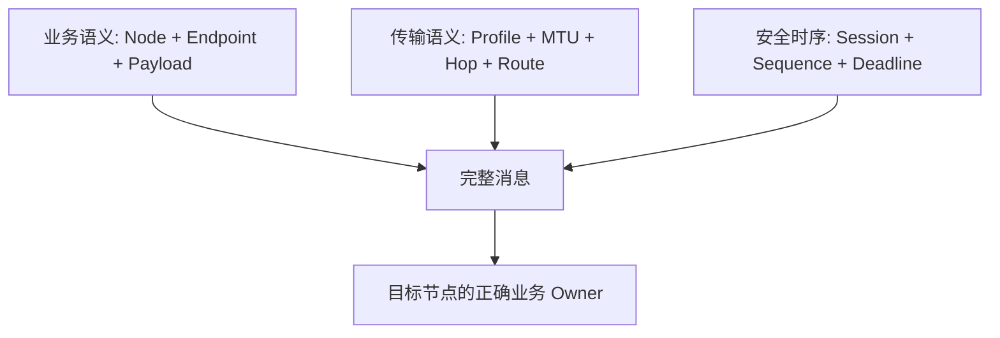

# 核心协议

> 文档级别：`NORMATIVE INDEX`
> 实现状态：`CURRENT`
> 适用版本：Core Wire v5
> 最近核对：`a093862`，2026-08-26

## 本章回答什么问题

本章从“一个 Node 如何被标识”开始，一直到“一条业务消息如何被编码、排队、跨跳转发、去重并交给目标 Endpoint”。读完后应能回答：

- Node、Endpoint、Session、Sequence 分别区分什么；
- W0～W3 为什么存在，一帧实际占多少字节；
- 消息提交后为什么不等待 Heartbeat；
- 邻居发现、业务分发、Q0～Q3 和背压如何衔接；
- 多路径重复、TTL、时间回绕和错误如何处理；
- Build Profile、Wire Profile 与 Link preset 为什么不能混为一谈。

本章只描述普通 UCN Core Wire v5。Cluster 控制面使用自己的 Wire v3/v4 和严格成熟度边界，不能把两者的版本号、帧长或发布状态混在一起。

## 推荐阅读顺序

1. [基础类型、ID 与网络域](01-基础类型、ID与网络域.md)：先建立地址、会话和业务寻址模型。
2. [Wire v5 W0～W3 帧格式](02-Wire-v5-W0至W3帧格式.md)：理解固定前缀、可变 Header 和 CRC/AAD 边界。
3. [帧语义、Payload 与开销](03-帧语义、Payload与开销计算.md)：学会计算业务效率和选择消息大小。
4. [Node 生命周期](04-Node初始化、Step与发送接收生命周期.md)：理解初始化、Owner step、发送和接收顺序。
5. [Neighbor、HELLO、准入与心跳](05-Neighbor发现、HELLO、准入与心跳.md)：理解设备如何加入、离开和维护直连状态。
6. [Endpoint 与业务分发](06-Endpoint与业务消息分发.md)：解决同一节点多传感器/多任务的数据区分问题。
7. [Q0～Q3、Deadline 与背压](07-Q0-Q1调度、Deadline与背压.md)：理解四级调度、Latest 与队列满。
8. [Sequence、Session 与重复抑制](08-Sequence、Session、重复抑制与重放边界.md)：区分网络去重和生产安全抗重放。
9. [Hop、时间与错误](09-Hop、TTL、时间与错误模型.md)：建立多跳、回绕安全时间和失败责任模型。
10. [Profile、MTU 与能力失败关闭](10-Profile协商、MTU与能力失败关闭.md)：理解异构节点/链路如何严格协商。

## 三条贯穿全章的主线

如果只理解其中一条，会产生典型误判：

- 只有地址没有 Endpoint：知道数据到哪台 MCU，却不知道交给 IMU 还是舵机任务；
- 只有 Payload 没有 Profile/MTU：业务定义了 8 KiB，但当前路径无法直接承载；
- 只有 Sequence 没有 Session/认证：能抑制短期重复，却不能宣称抗掉电重放；
- 只有 Q0 没有 Deadline/背压：高优先级旧命令可能在拥塞恢复后迟到执行。

## 选择下一章

- 要实现路由、指定路径和负载均衡：继续阅读 [03-路由与链路](../03-路由与链路/README.md)。
- 要对接 UART、CAN、Wi-Fi、USB：继续阅读 [05-Adapter与平台](../05-Adapter与平台/README.md)。
- 要做任务间通信和远端命令/结果：继续阅读 [04-传输与服务](../04-传输与服务/README.md)。
- 要发送大于普通 Frame 的消息：继续阅读 [04-传输与服务](../04-传输与服务/README.md)。
- 要评估认证、加密和重放：继续阅读 [06-安全](../06-安全/README.md)。

## 事实边界

- `CURRENT` 表示当前源码存在并有相应软件证据，不等于所有 MCU、驱动和拓扑均实测完成；
- 编译期最大值是表示/容量边界，不是推荐产品规模；
- `UCN_OK` 必须按具体 API 的接受边界解释，不能统一写成“远端执行成功”；
- Cluster 实验能力、默认关闭模块和 `AUDIT HOLD` 状态以其专章为准。
