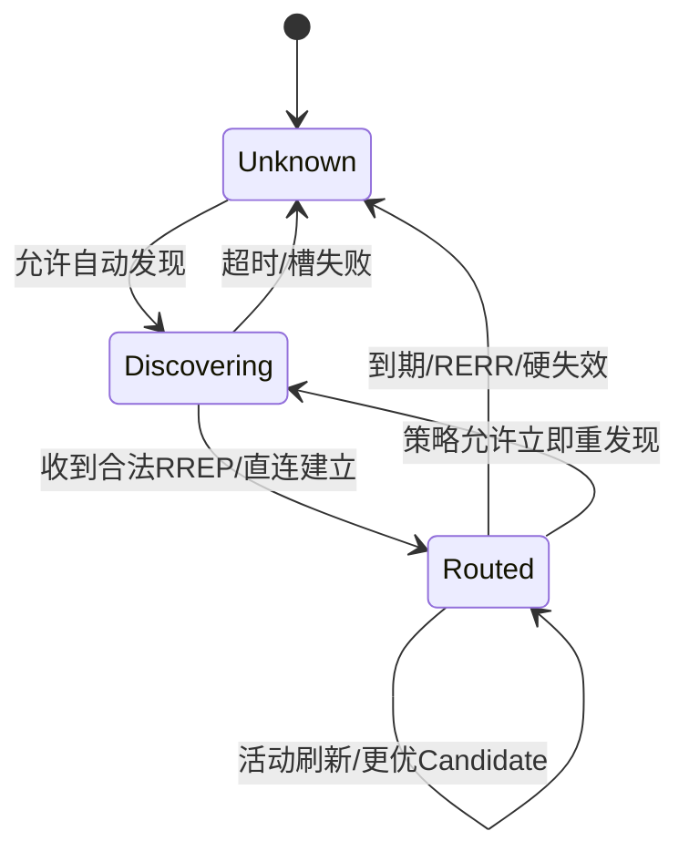

# Route 与 Candidate 缓存、老化和失效

> 文档级别：`NORMATIVE`
> 实现状态：`CURRENT`
> 最近核对：当前工作区，2026-09-04

## 为什么缓存

缓存避免每次业务帧都发 RREQ。一次发现或直连学习成功后，在 Route 有效期内直接使用下一跳，降低延迟和控制流量。

## Route 内容

动态 Route 至少绑定 Traffic Origin、目标、下一跳/Link、Hop、累计基础 Cost、Route Epoch/Sequence 和生命周期信息。其固定键为 `(route_origin,destination)`；Route Epoch 只能在这个域内解释。静态 Route 是人工配置的 Destination 通配项，诊断中以 `route_origin=0` 表示。具体内部结构不是应用 ABI，应用通过 API/诊断 View 读取。

## Candidate

Full 可为同一目标保留多个 Candidate。Candidate 的作用是：

- 同一次发现中保留不同下一跳；
- 主 Route 失效时快速切换；
- 后续发现更优 Cost 时替换；
- 为 Policy/Balance 提供有界选择来源。

Candidate 不是保存全网所有可能路径，也不是长期不失效的历史库。

## 老化

Route、Candidate、RREQ Cache、Discovery 和 Flow Binding 使用独立 Deadline。默认 Route 生命周期由配置宏控制；活动、回复或重新发现按实现规则刷新。

“缓存失效”表示旧下一跳不再可信，应删除或降级，并不是定时强制切换到另一条路径。

## 失效来源

- Neighbor/Bearer Down；
- Link 不可用；
- Route 生命周期到期；
- RERR；
- Wire Profile/MTU/Path capability 不再共同满足；
- 显式 Path revoke 或 Policy 修改。

失效后在途 Frame 不会被跨 Link 原子迁移。Node 只保证后续尚未提交的发送按新状态处理；需要端到端重试的数据使用 Transfer 或业务确认。

## Route、Candidate 和 Discovery 的状态关系

可以把一次目标可达性看成三个阶段：

Candidate 只存在于“已经观察到其他合法下一跳”的有界工作集内。它不会改变 Route 的目标语义，也不能绕过 MTU、Profile、Neighbor 准入或 Policy 约束。

## 缓存项为什么要绑定新鲜度

网络状态会变：节点移动、Wi-Fi peer 消失、UART 复位、CAN Bus-Off、Node 重启后 Session/Route Epoch 改变。只保存 Destination→Next Hop 而不保存生命周期，会让一个曾经有效的 Route 永久存在。

因此表项需要同时绑定来源的新鲜度信息和本地 Deadline。刷新只能由实现明确认可的事件触发；不能因为“有任意数据经过”就无限延长所有 Route。

## Candidate 如何成为活动 Route

候选切换前需要检查：

1. Candidate 仍未过期；
2. 下一跳 Neighbor/Bearer 仍可用；
3. 目标、Route Epoch/Sequence 没有陈旧；
4. Wire Profile、Hop、MTU 和 capability 满足当前帧/Path；
5. Policy 允许该 Link/Path；
6. 软质量切换满足“足够更好”与连续性，硬失败则立即排除旧路。

切换更新的是本地下一跳选择，不会暂停整个网络，也不会让所有节点同时重新计算全局路径。

### Candidate 激活与 ACK

Candidate 通过 Probe 后，发起端为它分配唯一非零 Route Epoch，并发送
`PATH_ACTIVATE(candidate_id,route_epoch)`。ACK 不是“只要 Candidate ID 相同就成功”：
它必须匹配本地发起、Probe 完成、已发送状态、Source/Destination、Wire Profile 和该
Candidate 已绑定的 Route Epoch。中继/目标收到首个合法 Activate 后也把 Candidate 绑定
到该 Epoch，同 Candidate ID 的换 Epoch帧必须在写状态前拒绝。

默认总 ACK Deadline 为 1000 ms，每 250 ms 可重发一次，初次发送之外最多重试 3 次。
每次重发保持 Candidate ID/Epoch，使用新的外层 Sequence。ACKED 后停止；耗尽时只清除
Candidate 并保留旧 Active Route，不能因为新路径验证失败而破坏仍工作的旧路。

首次 Probe 发送之后，Candidate 的 Link、Cost、Hop 和 Profile 是本次事务的冻结路径
快照。同 ID RREP 不能把更优的新路径覆盖到该槽并继承旧 Probe/RTT/Epoch；新路径必须以
新的 Candidate ID 重新进入完整证明流程。若 Neighbor 主 Bearer 在事务中变化，旧
Candidate 直接失效，迟到 ACK 不能把旧证明应用到新 Bearer。

## 缓存失效不等于定时切路

Route Deadline 到期的作用是“旧证据不再足以证明下一跳可信”。如果活动流量或合法维护已经刷新该证据，Route 可以继续使用。反之，即使 30 秒还没到，只要 Link Down 或收到 RERR，也必须立即失效。

所以不能把缓存 TTL 理解为“每 30 秒强制从 A-C 切到 A-D”。更优路径检查、Route 有效期和 Flow 粘滞是不同定时器。

## 容量满时如何处理

所有表为固定容量。新 Route/Candidate 到来时只使用空闲或已经到期的槽；没有安全可回收项时返回 `NO_SPACE`/拒绝，并增加 Route Instance 满载统计，而不是用另一个 Origin 的同 Destination 项或仍被显式 Path/Policy 依赖的状态顶替。

产品配置 Route 数量时，应统计本节点的并发目标工作集，而不是照全网 Node 总数一比一配置。边缘传感器可能只需少量上行 Route；网关/中继需要更大的邻居和路由工作集。

## Path 和 Route 的交叉失效

显式 Path 的逐跳表项可能引用某个 next hop/Link，但 Path 生命周期独立于普通 Route Cache。Link 硬失效时二者都必须被撤销或降级；普通 Route TTL 到期却不应无条件删除仍由合法 Path Control 维护的 Path 身份。

Policy 引用本地 Path handle。Path 被 revoke 后，Policy 不得继续解析出旧 Wire Path ID；`PINNED_STRICT` 失败，`PINNED_FAILOVER` 才按配置转向备 Path。

## 可观察信息

应用应通过受限 View/诊断查看：

- Route Origin、Destination、Next Hop、Link/Path handle；
- Hop、基础/有效 Cost；
- 当前状态和剩余生命周期；
- 失效原因；
- Candidate 数量与选择结果；
- Discovery pending/超时/失败统计。

诊断只提供有界快照，不承诺导出一个永久完整的全网路由数据库。

## 验证清单

- [ ] 每类表使用独立 Deadline，回绕附近行为正确；
- [ ] 活动 Route 不会因 Candidate 轻微波动反复替换；
- [ ] 硬 Link Down/RERR 立即使依赖项失效；
- [ ] MTU/Profile/capability 改变会重新裁决；
- [ ] Candidate 满载不覆盖不可回收项；
- [ ] 在途帧与尚未提交帧的切换边界有明确测试；
- [ ] Route TTL、质量探测周期和 Flow Lease 没有混成一个定时器。
- [ ] Activate ACK 精确绑定已发送 Candidate/Epoch，提前、错 Epoch 和越序 ACK 零写拒绝；
- [ ] ACK 丢失只触发有界重发，耗尽后旧 Active Route 仍可用。
- [ ] Probe 开始后的同 ID RREP/Bearer 变化不能迁移冻结路径或继承旧证明。
