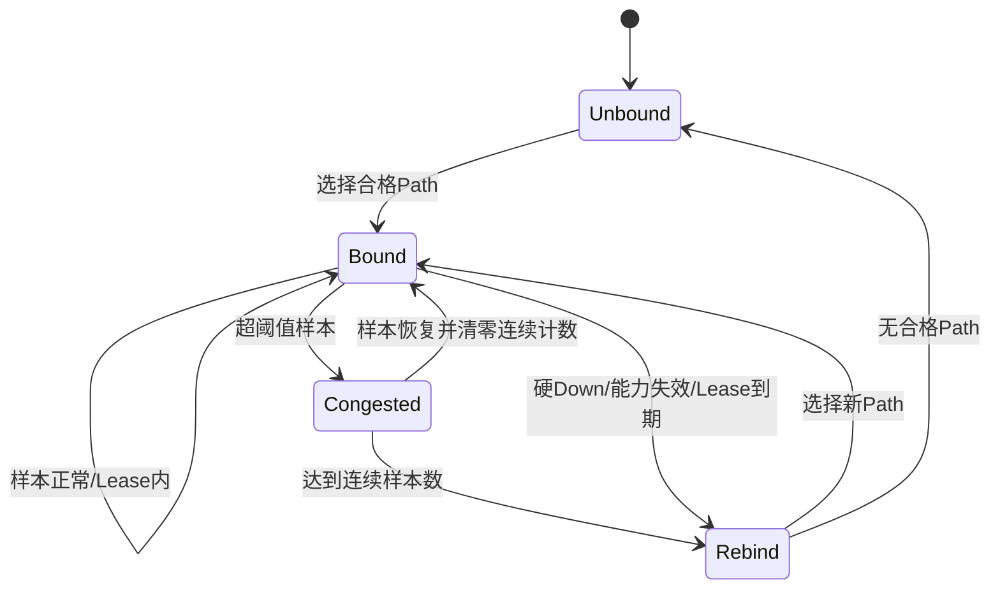

# Q1 负载均衡与 Flow 粘滞

> 文档级别：`NORMATIVE`
> 实现状态：Full `CURRENT`
> 事实源：`ucn_policy.h/.c`、Policy tests
> 最近核对：`a093862`，2026-08-25

## 范围

`AUTO_BALANCE` 只处理 Q1。Q0 关键控制不在多路之间自动抖动，应该使用明确 Auto Best 或 Pinned Policy。

## Flow key

Flow 由 Destination、Endpoint、Traffic Class 识别。选中 Path 后建立固定表 Binding，在 lease 内保持粘滞，避免连续数据帧在多路径上乱序。

默认参数由配置决定，包括：

- Flow lease；
- Queue pressure 阈值；
- 连续拥塞样本数；
- 固定 Flow/Path 表容量。

## 何时重绑

- 当前 Path 硬 Down；
- Path 持续超过拥塞阈值达到样本数；
- Binding 到期后重新选择；
- Policy/Path 配置变化；
- MTU/能力不再满足。

一次瞬时 Queue 高值不会立即迁移；持续拥塞才触发重绑。

## 负载均衡不等于逐帧轮询

UCN 当前按 Flow 分担，不是简单 Round Robin。这样可保留同一传感器流的顺序，同时让不同 Endpoint/目标/Flow 使用不同路径。

## 容量和失败

Flow 表满时不能动态分配。选择失败会增加明确统计并返回错误/回退到冻结策略，不得伪造一个不存在的 Path。

## 介质并行

若两个 Link Driver 能并行 DMA/发送，不同 Flow 可在物理层同时推进；协议 Owner 仍串行做选择和入队，避免共享状态竞争。

## 为什么限定为 Q1

Q1 传感器流通常允许在满足顺序和 Deadline 的前提下换路，且不同 Flow 之间天然可以分担。Q0 控制命令更看重固定、安全和可解释的交付路径；自动把相邻两条 Q0 发到不同介质，会增加乱序、重复执行和安全审计难度。

因此，调用方不能通过设置一个标志让 Q0 偷用 Balance。需要 Q0 备份时使用 `PINNED_FAILOVER` 或经过明确约束的 `AUTO_BEST`。

## Flow Binding 保存什么

一个 Binding 至少把 `(Destination, Endpoint, Q1)` 绑定到本地 Path handle，并记录 Lease/拥塞连续样本等状态。它不保存 Payload，也不等于远端订阅。

同 Endpoint 若需要区分多个独立发布流，产品应在 Endpoint/业务 ID 中定义可进入 Flow key 的稳定区分方式；当前实现不要假设 Payload 中任意字段会被路由层理解。

## 首次选择与后续重绑

不达标样本必须打断连续拥塞计数。否则 `高、低、高` 会被误当成连续两个高样本，造成抖动切换。

## Path 选择不是平均分配包数

假设有三条 Flow：IMU、温度和状态日志，两条 Path：UART 与 Wi-Fi。Balance 可以把 IMU 粘在 Wi-Fi、温度和日志粘在 UART；如果 Wi-Fi 高负载，再把某个完整 Flow 重绑。它不要求两条 Link 的 Frame 数严格 50/50。

选择依据仍是合格集合和有效 Cost。权重式分配、吞吐配额或 per-packet ECMP 如果未来加入，需要单独规范；当前不能从 `AUTO_BALANCE` 名称推断已经实现。

## 顺序、重复和 Deadline

Binding 粘滞减少多路径乱序，但硬故障重绑时仍可能出现：旧 Link 的后发 Frame 晚到、新 Link 的新 Frame 先到。普通 Sequence Window 可以接受窗口内乱序并抑制同 Frame 重复；业务若要求严格单调样本，应在 Payload 中带 sample counter 并由消费者丢弃陈旧值。

Q1 Latest 进一步让消费任务只取最新样本。它们是互补边界：Flow 保持网络路径稳定，Sequence 处理 Frame 重复/乱序，Latest 处理任务消费积压。

## 容量规划

Flow 表容量按本节点同时活跃的 `(Destination, Endpoint)` 工作集配置。表满时不能隐式把所有新 Flow 合并到一个槽。可选策略必须明确：返回 `NO_SPACE`、不建立粘滞而使用 Auto Best，或由产品减少 Flow 数；具体以 Policy API 合同为准。

## 可观测指标

- 当前 Flow→Path 映射与 Lease；
- 每条 Path 绑定 Flow 数；
- 连续拥塞样本和重绑原因；
- 硬故障、到期、Policy 修改的重绑次数；
- 表满/无合格 Path 次数；
- 重绑期间的乱序、重复、P95/P99 延迟。

## 验证清单

- [ ] Q0 无法配置 AUTO_BALANCE；
- [ ] 同 Flow 在 Lease 内保持同一 Path；
- [ ] 不达标样本会重置连续拥塞计数；
- [ ] 硬 Down 不等待普通拥塞样本；
- [ ] Policy/Path 能力域变化不继承旧 Binding；
- [ ] 表满行为确定且不越界；
- [ ] 多 Link 实机验证记录 Flow 分布而不是只看总吞吐。
