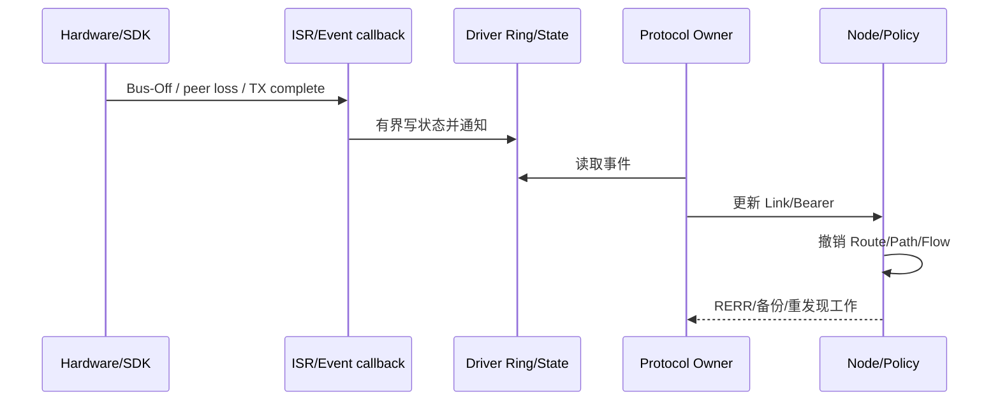

# 多 Bearer 故障检测与切换时序

> 文档级别：`NORMATIVE`
> 实现状态：`CURRENT`；真实介质切换性能需产品实测
> 最近核对：`a093862`，2026-08-25

## 检测来源

- Driver 主动报告 Link Down/Bus-Off；
- send 返回 Link Down；
- Heartbeat/Neighbor Bearer 超时；
- Path Probe/ACK；
- Metrics 新鲜度和连续质量样本；
- Adapter Queue、TX/RX failure 和 medium state。

主动硬件故障通知通常比等待 Heartbeat 更快。产品应把 CAN Bus-Off、UART Driver reset、Wi-Fi peer loss 等及时映射到 Link 状态。

## 切换流程

```text
发现候选更好
  ↓ 连续采样/滞回确认
候选保持可用且能力/MTU满足
  ↓
更新 Primary Bearer/Route/Flow（不修改逻辑 Neighbor ID）
  ↓
后续新发送走新 Link
```

硬 Down 跳过普通“更好”滞回，直接把旧路径标 Down 并走备份/发现。

## Probe 代价

质量 Probe 是有界低频控制，不为每个业务帧探测一次。采样间隔、连续样本和 hold time 控制额外流量与抖动。具体周期需根据介质速度、移动性和控制时延配置。

## 在途数据

- 已交给旧 Driver 的帧结果由旧链路决定；
- Node Queue 中尚未提交的帧可在下一次调度使用新路径；
- Transfer 未确认片段按 ACK/Retry 机制恢复；
- 业务命令需 Command ID/幂等防止重试产生重复动作。

“无缝”必须在特定拓扑下测量 P50/P95、丢包、重复和乱序，当前通用协议只提供切换机制，不承诺所有 Driver 零波动。

## 硬故障与软退化必须分开

| 类型 | 示例 | 处理时机 |
| --- | --- | --- |
| 硬故障 | Driver Link Down、CAN Bus-Off、peer 已删除、Path revoke、MTU 突然不满足 | 立即排除旧 Bearer，不等待滞回 |
| 活性超时 | 连续没有合法 Heartbeat/HELLO | 租约到期后排除 |
| 软退化 | RSSI 下降、RTT 上升、queue pressure 增加 | EWMA + 连续样本 + 20% 滞回 |
| 指标陈旧 | Driver 不再更新 Metrics | 先加 stale penalty，超过上限排除 |

如果把硬故障也当成软退化，切换会无谓等待；如果把一次 RSSI 抖动当硬故障，网络会频繁振荡。

## 故障通知如何穿过架构层



ISR 不直接遍历路由表。Owner 串行应用事件，保证同一时刻 Link Down、RX Frame 和 Policy 更新有确定顺序。

## 节点离网时整个网络会做什么

节点 C 完全离开后，不会瞬间让全网广播一次大清表：

1. C 的直连邻居先通过硬通知或 Heartbeat Lease 发现其 Bearer 失效；
2. 若还有其他 Bearer 到 C，逻辑 Neighbor 可继续存在；
3. 全部 Bearer 失效后，邻居撤销以 C 为下一跳的 Route/Path；
4. 只向实际依赖方向发送 RERR；
5. 上游在下一次业务或维护时使用备 Candidate/Path 或重新发现；
6. 无用的 Discovery、Flow、Trace 和诊断槽按各自 Deadline 回收。

这种局部收敛避免一个边缘节点离开导致全网瞬时风暴。

## 新节点接入的代价

新节点先与直连 Link 交换 HELLO/准入，建立 Bearer/Neighbor；只有其他节点需要访问它且没有 Route 时，才在受控 Hop Scope 内发现。它不会因为开机就强迫每个节点保存一条到它的 Route。

入网瞬间代价由直连 HELLO、必要 Route Discovery 和业务订阅决定。HELLO jitter、控制预算和固定槽可降低大量节点同时上电的同步峰值。

## 探测周期如何选

探测不是一个全局固定答案，应满足：

```text
检测时间预算 >= Driver通知延迟 或 Heartbeat间隔×丢失阈值
探测流量预算 >= 每条活动Bearer的控制开销
滞回时间 < 业务可容忍的退化持续时间
```

高速有线接口更适合依赖 Driver 硬事件和较短租约；低速 LoRa 应减少探测频率；移动 Wi-Fi 可更频繁更新 Metrics，但仍不能每个业务帧先 Probe。

## 先探测后切换的实现语义

当候选只是“可能更好”时，可以继续用当前路径，并在控制预算内发送 Probe/观察真实 ACK、RTT 和质量。只有候选连续满足门限后，才更新后续发送的 Primary/Flow Binding。这个过程不会复制每一条业务数据到候选；额外代价是少量受限探测帧。

硬故障例外：旧路径已经不能使用，不应为了“无缝”继续等待测试候选。

## 实机验收指标

- 故障发生到 Link 状态更新的时间；
- 状态更新到第一条新 Link 成功帧的时间；
- 切换窗口丢失、重复和乱序帧数；
- Q0 是否在 Deadline 内明确成功/失败；
- Transfer 是否只重传未确认 Fragment；
- 切换期间 Heartbeat/RREQ/RERR/Probe 控制字节数；
- 各 Driver Ring/Queue 高水位和 CPU 占用。

没有这些绑定硬件、固件、波特率和拓扑的数据，不能把 Host 状态机测试写成“零波动无缝切换”。
