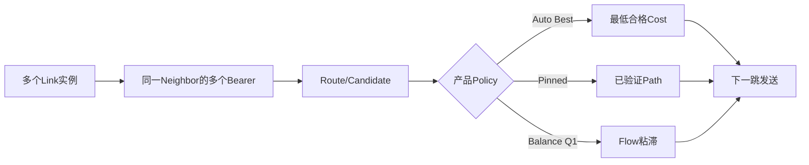

# 路由与链路

> 文档级别：`NORMATIVE INDEX`
> 实现状态：Lite/Full 动态路由；Full Path/Policy
> 最近核对：`a093862`，2026-08-25

本目录解释从物理 Link 到自动 Route、显式 Path、动态 Cost 和 Q1 负载均衡的完整关系：

1. [核心对象关系](01-Link、Bearer、Neighbor、Route与Path关系.md)
2. [AODV-Lite](02-AODV-Lite路由发现与RREQ-RREP-RERR.md)
3. [缓存与失效](03-Route与Candidate缓存、老化和失效.md)
4. [Path 与路径诊断](04-Path安装、转发与完整路径诊断.md)
5. [Link Metrics 与 LC-1](05-Link-Metrics与LC-1动态Cost.md)
6. [自动、指定和故障回退](06-自动选路、指定路径与故障回退.md)
7. [Q1 自动负载均衡](07-Q1负载均衡与Flow粘滞.md)
8. [故障检测与切换时序](08-多Bearer故障检测与切换时序.md)
9. [规模、跳数与复杂度](09-路由规模、跳数、寻址距离与复杂度.md)

## 本章的主线

UCN 不要求源节点保存完整路径。每个中继只保存与其当前工作集有关的“目标→下一跳/Link”，首次未知目标时用受限 AODV-Lite 发现，之后使用缓存。需要固定路线、安全 Path ID 或完整节点序列时，再显式使用 Path/Trace。

## 读完后应能回答

- B 为什么知道目标 C 应交给哪个下一跳，而不是交给 D；
- 为什么正常发送不需要每帧重新寻路；
- UART、CAN、Wi-Fi 同时存在时怎样形成多 Bearer；
- Base Route Cost 与瞬时 Effective Select Cost 为什么分开；
- 固定 Path、主备故障切换和 Q1 自动均衡分别适合什么业务；
- 节点离网、新节点入网和更优路径出现时网络怎样局部收敛；
- 地址上限、本地表容量和实际网络规模为什么是三个概念。

## 推荐路线

- 只需自动多跳：`01 → 02 → 03 → 08`；
- 需要手动固定路线：在前述基础上读 `04 → 06`；
- 需要动态选优/均衡：读 `05 → 06 → 07`；
- 做产品容量评估：最后读 `09`，并结合配置与资源、测试证据章节。

## 成熟度边界

Lite/Full 的自动 Route 属于当前 Core 能力；显式 Path/Policy/Balance 需要 Full。Host 测试可证明算法和固定容量边界，但不同 UART/CAN/Wi-Fi Driver 的切换时间、吞吐和 RF 稳定性必须在目标硬件上单独测量。
