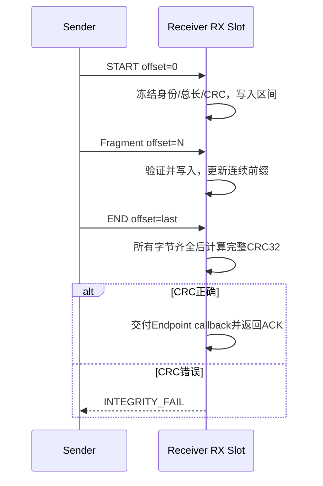

# 分片、重组、CRC32 与 RX Handle

> 文档级别：`NORMATIVE`
> 实现状态：`CURRENT`
> 最近核对：`a093862`，2026-08-25

## Fragment

T128～T8K 的每个 Fragment Payload 含 14 B Transfer Header：目标 Endpoint、Class、Flags、Transfer ID、总长度、Offset、完整消息 CRC32 和本片数据。

`START/END` 标志与 Offset/Total Length 必须一致。坏格式、越界、重叠、Class/长度不匹配、未知 Flags 直接拒绝。

## 双层完整性

1. 每个 UCN Frame 自带 CRC16，发现本片线传输损坏；
2. 所有片重组完成后计算完整 Message CRC32，发现遗漏、错序拼接或跨片错误。

因此大消息不是只校验首尾或单片。

## RX Slot

接收端使用固定数量 Slot。Slot 绑定 Source、Session、Transfer ID、Endpoint、Class、总长和 CRC。冲突事务不能覆盖正在重组的合法消息。

Slot 到期释放；无空闲 Slot 返回明确 ACK 状态，不动态分配。

## RX Handle

接收 callback 得到 Handle。对于固定重组缓冲，业务在处理完成后调用 release；在释放前不得假设该 Slot 可接收下一条大消息。

T32/T64 直接交付可使用 Direct Handle，不占大消息重组 Slot。

## 业务缓冲

业务回调只在完整 CRC 通过后获得整条消息。中间节点只转发 Fragment，不重组端到端消息，因此不需要每个中继都分配 8 KiB 缓冲。

## 14 B Fragment Header 如何绑定事务

Header 把本片绑定到目标 Endpoint、Transfer Class、Transfer ID、总长度、Offset、整条消息 CRC32 和 START/END Flags。接收端不能只按 Transfer ID 找 Slot，因为不同 Source/Session 可能同时使用相同 ID。

完整 RX 身份至少是：

```text
(Source Node, Source Session, Transfer ID, Target Endpoint)
```

并在首次片冻结 Class、Total Length 与 Message CRC。后续片任何一项不同都属于冲突，不得覆盖原 Slot。

## Offset、START 和 END 的一致性

- START 只能对应 `offset=0`；
- END 必须使 `offset + data_length == total_length`；
- 非 END 片不能越过 total length；
- data length 不能为 0；
- total length 必须落在声明 Class 和本地上限内；
- 片区间不得与已接收区间以不同内容冲突；
- 未知 Flags 必须拒绝。

严格检查防止恶意/损坏 Offset 写出固定缓冲边界。

## 重组的实际过程



Fragment 可以乱序到达，但累计 ACK 只确认从 0 开始的连续前缀。接收表如何标记已收区间是内部实现，不对应用暴露。

## CRC16 与 CRC32 各自防什么

Frame CRC16 保护一片的 Wire 字节，能够尽早丢弃物理损坏。Message CRC32 覆盖原始完整消息，即使每片 CRC16 都合法，也能发现错误组合、跨事务拼接或重组逻辑问题。

CRC 不是认证。攻击者可以重算 CRC；需要防篡改时仍要使用 Security Provider/AEAD 和业务授权。

## RX Slot 冲突与重复片

精确重复 Fragment 可根据已接收区间幂等处理并重发累计 ACK；相同身份但不同 total/CRC/Class，或重叠区间数据不一致，必须拒绝。新 START 不能无条件清掉一个已经完成但尚未提交业务的 Slot。

Slot 完成后会在 configured hold/recent completion 期间记住结果，用于回答迟到重复片，避免对端因最终 ACK 丢失而重新占用一个 8 KiB Slot。

## RX Handle 的所有权

回调获得大消息 Handle 后，重组缓冲仍由 Transfer 对象拥有。业务可以在回调/之后读取，但必须在完成处理后调用 `ucn_transfer_release_received()`。在 release 前：

- 该 Slot 不能接收新大消息；
- 应用不能保存裸指针后先 release 再继续读取；
- 长时间占用会对远端表现为 NO_SLOT。

Direct T32/T64 使用固定 `UCN_TRANSFER_RX_HANDLE_DIRECT=0`，不需要释放大重组 Slot；业务仍应遵守 callback 中 Payload 生命周期合同。

## 中继为什么不重组

如果 A→B→C 的 B 也分配完整消息缓冲，8 KiB 消息会让每个中继都消耗 8 KiB RAM，并增加整包等待延迟。当前设计让 Fragment 成为普通 routed frame，B 只验证/转发单片，只有 C 重组。

这也意味着中继无法根据完整业务内容重新分片；MTU 变化由发送端在 ACK/重试边界调整后续 Fragment。

## 验证清单

- [ ] START/END/Offset/Total/Class 所有组合边界有负向测试；
- [ ] 相同 Transfer ID 的不同 Source/Session 不冲突；
- [ ] 重叠不同内容、越界和零数据片被拒绝且无写回；
- [ ] 每片 CRC16 与整包 CRC32 均实际覆盖完整数据；
- [ ] 完成 Slot 不会被下一 START 静默覆盖；
- [ ] release 前后 Handle 生命周期正确；
- [ ] 中继没有链接/分配端到端重组缓冲。
