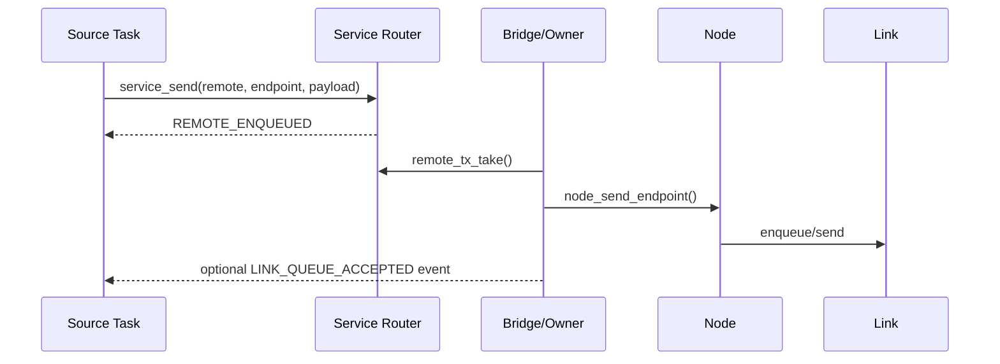

# Service Bridge 与跨 MCU 任务通信

> 文档级别：`NORMATIVE`
> 实现状态：`CURRENT`
> 事实源：`ucn_service_bridge.h/.c`、Service Bridge tests
> 最近核对：`a093862`，2026-08-25

## 两条路径

```text
目标 Node == 本机
Task A → Service Router → Task C Inbox

目标 Node != 本机
Task A → Remote Queue → Service Bridge → Node/Route/Link
       → 目标 Node Bridge → Service Router → Task C Inbox
```

本机 Fast Path 不完整走一遍 Frame 编解码和物理 Link，减少 CPU/RAM/延迟；但 Endpoint、Payload、Q0～Q3、ACL 和结果语义保持一致。

## Bridge 责任

- 从 Router 固定 Remote Queue 取消息；
- 编码 Service Envelope 到静态 Endpoint；
- 调用 Node Send；
- 收到远端 Service Frame 后验证来源、长度、Traffic 和 Validator；
- 投递目标 Binding；
- 记录 Link Queue 接受或失败统计。

## 不负责的内容

- 不创建或调度具体业务任务；
- 不替代产品的命令幂等/权限判断；
- 不把 Node send success 当作远端执行完成；
- 不为任意大 Payload 自动使用 Transfer，超出 Service 上限应设计专用 Transfer Endpoint。

## 实时数据

另一个节点可持续订阅/请求某传感器数据，由生产者任务按周期发送到对应 Endpoint。Q1 Latest 适合只关心最新样本；需要每样本完整到达则应降低频率、使用 FIFO/Transfer 或业务序号检测丢样。

## Bridge 为什么独立于 Router 和 Node

Router 只管理任务消息和 Inbox，不知道路由/Link；Node 只处理 Endpoint Frame，不知道 Service ID/任务 Ready。Bridge 位于二者之间，负责把 Remote Queue 的固定消息变成 Node Endpoint send，并把 Node 收到的 Endpoint Frame送入 Router。

分开后可以：

- Core-only 产品完全不链接 Service；
- 本机任务 Fast Path 不承担 Frame 开销；
- Service 可在 Host Fake 上独立测试；
- Node/Route 不需要依赖任何 RTOS Task API。

## 初始化顺序

推荐顺序是：

1. 初始化 Service Router 和 static Binding；
2. 初始化 Node、Link、Route/Security；
3. 初始化 Protocol Bridge，绑定 Router 与 Node；
4. 为需要接收远端的 Endpoint 配置 Validator；
5. 安装 Endpoint Handler；
6. 设置 inbound/outbound hooks、Q0 backpressure policy；
7. 各业务任务 ready 后才允许远端投递；
8. 唯一 Owner 周期调用 `ucn_service_protocol_bridge_step_at()`。

如果先安装远端 Q0 Handler 却没有产品要求的 Validator，必须 fail-closed。

## 出站一步步发生什么



Bridge 取走 Remote Queue 后拥有局部副本。如果 Node 临时背压，Q0 可以按显式 policy 保留一个有 Deadline 的 pending 并有界重试；Q1 则按实时语义处理。失败不能丢失统计或伪装成成功。

## 入站一步步发生什么

1. Node 完成 Wire/安全/重复/目标检查；
2. Endpoint Handler 进入 Bridge；
3. Bridge 查找对应 Binding 和 Validator；
4. 检查 Source、Session、长度、Traffic、远端访问和产品策略；
5. 可选 replay/Command Guard 状态验证；
6. 调用 `ucn_service_deliver_remote()` 写目标 Inbox；
7. 记录 inbound event；
8. 业务 Task `inbox_take()` 后自行验证设备状态并处理。

任何一步失败都不应调用后续步骤，也不应更新与本消息无关的 replay/业务状态。

## 跨 MCU 请求-结果示例

节点 A 的任务想读取节点 B 的气压：

- A 向 `B:BARO_REQUEST` 发 Q0/T32 请求，带 request ID；
- B Bridge 投递气压任务；
- B 任务读取传感器；
- B 向 `A:BARO_RESULT` 发 Q1/Q0 结果，带同一 request ID 和测量值；
- A 任务匹配 pending request，超时则明确失败。

另一种实时方式是 B 周期向 A 的 `BARO_SAMPLE` 推送 Q1；A 不必每个样本都请求。UCN 不内置 topic discovery，订阅和发布周期由产品协议定义。

## 多任务和多节点扩展

同一 MCU 可有多个 Service Binding；同一 Endpoint 只有一个本地 Owner。多远端节点都可向该 Endpoint 发送，但 Validator 可按 Source/Session 限制。若需要把一份样本发给三个节点，生产任务发三条目标明确的消息，或产品层建立 multicast/pub-sub；当前 Service 不把广播自动解释为多订阅确认。

## 背压传播

| 位置 | 现象 | 应对 |
| --- | --- | --- |
| Router Remote Q0 满 | source send 立即失败 | 生产者降速/有限重试 |
| Bridge pending 占用 | 下一 Q0 无空间 | 调整 Owner/Link，不扩大为无界链表 |
| Node/Link Queue 满 | Bridge 收到 NO_SPACE | 按 Deadline 有界重试 |
| 远端 Inbox 满/未 Ready | 远端拒绝 | 用业务 Result/统计反馈，不能靠本地 UCN_OK 推断 |

## 验证清单

- [ ] 本地与远端走不同物理路径但保持相同 Endpoint/Payload ABI；
- [ ] Handler 安装前远端 Q0 Validator 门禁有效；
- [ ] Bridge step 只由唯一 Owner 调用；
- [ ] 出站各接受阶段事件顺序正确；
- [ ] 入站失败不污染 Inbox/replay 状态；
- [ ] Q0 背压重试有上限和 Deadline；
- [ ] 实时推送与请求-结果两种模式均有端到端测试。
