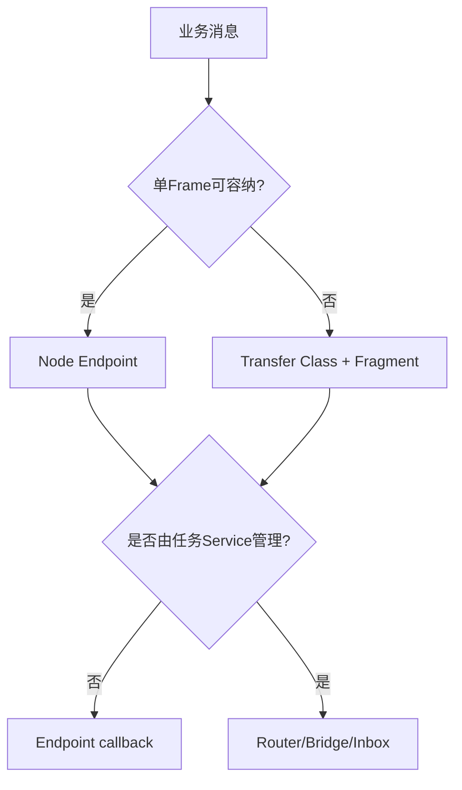

# 传输与服务

> 文档级别：`NORMATIVE INDEX`
> 实现状态：`CURRENT`，均为可选组件
> 最近核对：`a093862`，2026-08-25

Core 普通 Endpoint 适合单帧小消息；`ucn_transfer` 处理 32 B～8 KiB 逻辑消息；Service 统一本机任务与跨 MCU 任务通信。

1. [消息大小等级](01-消息大小等级T32至T8K.md)
2. [分片、重组与 CRC](02-分片、重组、CRC32与RX-Handle.md)
3. [ACK、窗口与重试](03-ACK、窗口、重试、并发与Deadline.md)
4. [MTU 与多跳 Transfer](04-MTU变化、中继与多跳Transfer.md)
5. [Service Router](05-Service-Router、Binding与Inbox.md)
6. [跨 MCU Service](06-Service-Bridge与跨MCU任务通信.md)
7. [命令与业务结果](07-命令、结果与业务确认语义.md)
8. [实时传感器与控制](08-实时传感器流与控制消息使用原则.md)
9. [性能调优](09-吞吐、延迟与背压调优.md)

## 两个可选组件各自解决什么

Transfer 和 Service 可以独立使用，也可以组合：

- Transfer 解决“一条逻辑消息大于当前单帧 Payload 时，怎样有界分片、重组和确认”；
- Service 解决“一个 Node 内有多个任务时，怎样用 Endpoint 统一本机/远端消息所有权”；
- Service 的普通消息上限仍是固定小 Payload，大块业务应定义 Transfer Endpoint，而不是让 Router 隐式分配 8 KiB；
- 两者都不是 Cluster 的前置条件，Core-only 也不会因它们未链接而承担 RAM。

## 读完后应能回答

- T8K 为什么不是一帧 8 KiB；
- 每片 CRC16 与整包 CRC32 为什么都需要；
- Window、累计 ACK、Go-Back-N 和并发怎样影响 RAM/吞吐；
- 路径 MTU 变小时为什么可以从已确认 Offset 继续；
- 一个 MCU 的多个任务为何不需要各自成为 Node；
- 本地入队、Link 接受、远端入 Inbox 和业务执行有什么区别；
- 如何让远端持续接收某传感器数据，或向某任务发命令并得到结果。

## 阅读路线

- 只关心大消息：`01 → 02 → 03 → 04 → 09`；
- 只关心任务通信：`05 → 06 → 07 → 08`；
- 大块参数/日志交给远端任务：两条路线都读，并在产品层定义 Transfer Endpoint 与 Result 语义。

## 成熟度边界

当前 Transfer/Service 有软件实现和测试，但真实吞吐、窗口、任务优先级、Driver DMA 和多跳损失仍需目标板标定。普通 Transfer 不能直接外推为跨簇 Federation 大消息已经生产闭环；`DELIVERED` 也不能外推为远端业务已执行。
