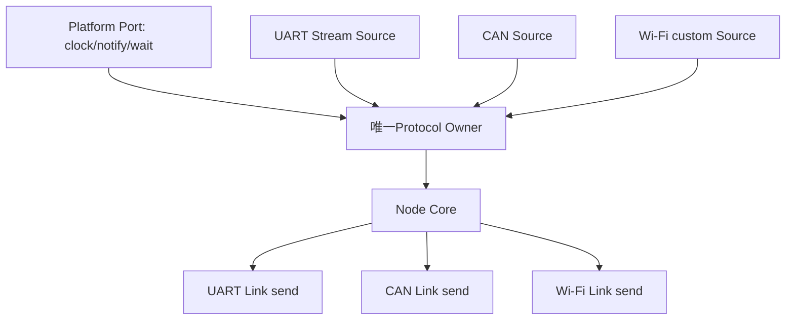

# Adapter 与平台

> 文档级别：`NORMATIVE INDEX`
> 实现状态：`CURRENT`；真实 BSP/SDK glue 由产品提供
> 最近核对：`a093862`，2026-08-25

本目录区分四层：Link 语义、Adapter/Source、Port/Owner、真实硬件 Driver。

1. [Link 与 Adapter](01-Link与Adapter公共契约.md)
2. [Standard Adapter 与默认 Cost](02-Standard-Adapter预设与默认Cost.md)
3. [Event Runtime 与 Owner](03-Event-Runtime与Protocol-Owner.md)
4. [Stream Source](04-Stream-Source与COBS载体.md)
5. [CAN Source](05-CAN-FD与Classic-CAN载体.md)
6. [裸机](06-裸机Port.md)
7. [FreeRTOS](07-FreeRTOS-Port.md)
8. [Zephyr](08-Zephyr-Port.md)
9. [NuttX](09-NuttX-Port.md)
10. [RT-Thread](10-RT-Thread-Port.md)
11. [Host/Linux/ROS 2](11-Host-Fake、Linux与ROS2边界.md)
12. [无线介质对接](12-WiFi-ESP-NOW-BLE-LoRa对接规范.md)
13. [自定义扩展](13-自定义Port、Adapter与Source模板.md)
14. [多实例](14-多串口、多CAN与多Bearer实例化.md)

## 本章解决的核心问题

UCN 只定义统一通信核心，不可能猜每块板的 GPIO、UART 号、CAN filter 或无线 SDK。Adapter/Port 架构的目标是：公共协议保持不变，产品只实现少量明确 glue，就能把多个真实介质接入同一个 Node。

## 读完后应能回答

- Driver、Source、Adapter、Link、Port、Owner 各自负责什么；
- 为什么所有外设都可用“ISR写Ring→通知Owner→有界service”的统一模型；
- 裸机、FreeRTOS、Zephyr、NuttX、RT-Thread 只需替换哪一层；
- UART/USB 字节流为什么用 COBS，CAN-FD padding 和 Classic CAN Carrier 如何处理；
- 一个 Node 是否能接多个 UART、多个 CAN 和多个无线 Link；
- Standard preset 为什么只是默认配置而不是完整 Driver；
- Linux/ROS 2 为什么是可选桥而不是 MCU 网络中心。

## 接入路线

1. 先读 `01～03`，冻结公共边界和 Owner 模型；
2. 按介质读 `04/05/12`；
3. 按平台读 `06～10`；
4. 新介质/平台读 `13`；
5. 多接口产品读 `14` 并做总资源预算。

## 当前成熟度

Stream/CAN Source、公共 Adapter、Event Runtime 和平台 wrapper 有当前源码/软件测试。GPIO、Driver、SDK callback、真实 ISR/DMA、RF、目标 Task 栈和功耗由产品实现，不能因为 preset 或 wrapper 名称存在就声称某开发板已开箱即用。
