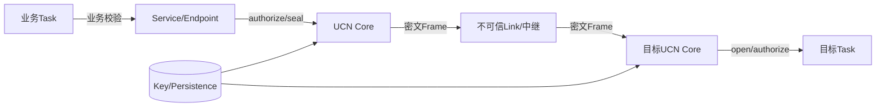

# 威胁模型与信任边界

> 文档级别：`NORMATIVE`
> 实现状态：`CURRENT` 设计边界
> 事实源：Security/Node/Service/Cluster 公共 API 与测试
> 最近核对：`a093862`，2026-08-25

## 需要防护的威胁

- 无线或有线链路被监听；
- Payload、目标、Endpoint 或 Path 身份被篡改；
- 旧帧、旧命令、旧 Vote/Config 被重放；
- 未授权节点伪造控制帧、诊断请求或高风险 Q0；
- 中继节点读取本不需要知道的业务数据；
- 节点重启导致 Session/Sequence 回退；
- 表满、队列满或故障时安全门禁被绕过；
- Cluster 旧 Authority 在新 Epoch/Config 后继续产生副作用。

## Core 可提供的边界

- Frame CRC：发现非恶意传输损坏，不提供身份认证；
- E2E Provider：产品可对 Payload seal/open 并绑定 AAD；
- TX/RX authorize：产品可按 Node/Link/Endpoint/Session 决策；
- Sequence/Session：提供重放域和持久化/轮换接口；
- opaque forwarding：中继无需解密 E2E Payload；
- Endpoint/诊断 authorizer 和 Service Q0 Validator；
- Cluster Persistence/Authority/Fence 的软件安全合同。

## 产品必须承担

- 真实设备身份与可信启动；
- 密钥生成、分发、存储、吊销和轮换；
- 经审计的 AEAD 实现及 nonce 规则；
- Flash/NVS 原子持久化和防回滚；
- Driver、物理总线和调试口安全；
- 业务命令权限、时效、幂等和安全状态；
- 被攻陷节点、物理探针和侧信道处理。

## 不应混淆

Network ID 是隔离域，不是密钥；CRC 是完整性检测，不是 MAC；Node ID 是地址，不天然是认证身份；“加密”不自动证明发送者合法；通过 Host 测试不等于密码实现经过审计。

## 要保护的资产

安全设计先明确资产，而不是先选算法：

- 控制命令的真实性、顺序和时效；
- 传感器/状态数据的机密性与完整性；
- Node、管理员和 Cluster Authority 身份；
- Session/Sequence/Term/Config 等单调状态；
- 路由、Path、Endpoint 和策略绑定；
- 密钥、持久化记录和升级镜像；
- 设备可用性、队列和有限 RAM；
- 机械/电气系统的安全状态。

不同产品可以只要求部分数据保密，但控制真实性和失败关闭通常不能省略。

## 攻击者能力分级

| 攻击者 | 能力示例 | UCN/产品边界 |
| --- | --- | --- |
| 被动监听者 | 抓无线/CAN/UART 流量 | E2E/逐跳加密保护 Payload；外层元数据仍可见 |
| 主动链路攻击者 | 注入、删包、改包、重放 | AEAD、Session/Sequence、ACL、Deadline；DoS 只能有界缓解 |
| 未授权 UCN 节点 | 有合法协议栈但无业务权限 | authorize、Endpoint ACL、诊断/管理 authorizer |
| 被攻陷中继 | 能读改本机 RAM/转发 | E2E Payload 不可读改；可丢包/流量分析，需容错/路由 |
| 被攻陷端点 | 拥有自身 Key 和业务权限 | 无法由网络协议完全挽救，需最小权限/隔离/吊销 |
| 物理攻击者 | 读 Flash、调试口、故障注入 | Secure boot、Key storage、调试锁、硬件安全，不属于 Core 单独能力 |

威胁模型若不包括物理攻击，就不能在结论里宣称“密钥无法读取”。

## 信任边界图

Link 和中继默认可被观察/篡改；Provider 和持久化位于产品信任边界内；业务 Task 仍要验证参数和设备状态。Gateway 若解密/改 Endpoint，就成为新的可信端点。

## 可用性与资源攻击

攻击者可发送大量 HELLO、RREQ、Fragment、Trace 或认证失败帧，消耗 CPU/固定槽。UCN 通过静态容量、Hop、Deadline、控制预算、authorizer 和 fail-closed 限制损害，但不能保证无线干扰下仍可用。

产品还需：Driver filter/rate limit、管理接口低频限制、认证失败告警、watchdog 和安全降级。表满时不能为了可用性覆盖持久 Authority 或放宽 ACL。

## 路由安全边界

E2E 保护可绑定 Source/Destination/Endpoint/Path ID，但普通下一跳和 Link 选择仍可能受本地拓扑影响。安全产品应：

- 对 Neighbor/Path Control 做身份准入；
- 对敏感 Endpoint 使用 Pinned Path/安全网关；
- 让中继无法把受保护 Path ID 换成另一身份；
- 接受“中继能丢包”这一不可避免能力；
- 不把最低 Cost 等同于最高安全等级。

## 重启与降级攻击

掉电后 Session/Sequence、Cluster Term/Config 若回退，旧捕获消息可能重新有效。持久化失败必须停止相关承诺。版本/能力协商也不能自动降级到旧明文模式；兼容路径必须显式配置并限制角色/Endpoint。

## 产品威胁模型输出

每个产品应形成表格：资产、攻击者、入口、保护、残余风险、检测、恢复、验证证据。至少覆盖无线、物理接口、调试口、升级、密钥、管理诊断、控制命令和节点丢失。

## 验收问题

- 哪些 Endpoint 必须保密/认证/持久防重放？
- 中继是否可信，是否允许看到 Payload？
- 谁能安装 Path、查询拓扑、修改 Config？
- Node ID 如何绑定硬件身份并处理冲突？
- Key/Session/Sequence 掉电和轮换如何原子恢复？
- Provider/Flash/队列失败时设备进入什么安全状态？
- 物理调试口和 OTA 是否绕过网络安全？
- 哪些风险明确接受而非宣称已解决？
