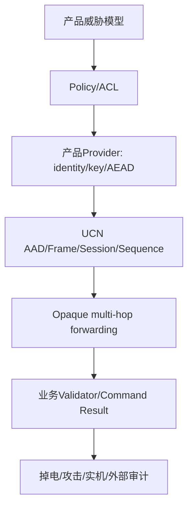

# 安全

> 文档级别：`NORMATIVE INDEX`
> 实现状态：安全接口与失败关闭门禁 `CURRENT`；通用生产身份/密钥/AEAD `PARTIAL`
> 最近核对：`a093862`，2026-08-25

UCN Core 定义安全 Policy、Provider、AAD、授权和重放边界，但不自行实现可直接用于生产的密码算法与密钥系统。

1. [威胁模型与信任边界](01-威胁模型与信任边界.md)
2. [安全 Policy 与 Provider](02-安全Policy与Provider接口.md)
3. [E2E AAD 与透明密文转发](03-E2E-AAD、透明密文转发与逐跳边界.md)
4. [Session、Sequence 与持久化](04-Session、Sequence、持久化与重放窗口.md)
5. [Endpoint/Service/诊断授权](05-Endpoint-ACL、Service命令保护与管理诊断.md)
6. [生产安全接入清单](06-生产密钥、AEAD与安全接入清单.md)
7. [当前能力与未完成项](07-当前安全能力与未完成项.md)

任何产品在完成第 6、7 篇的门禁前，都不能仅因测试 Provider 通过而声明“UCN 已生产安全”。

## 本章的安全分层

UCN 提供中间几层的接口和失败关闭合同，但身份根、Key、具体 AEAD、Flash 防回滚和设备安全状态必须由产品补齐。

## 读完后应能回答

- CRC、Network ID、Node ID、加密和认证分别能证明什么；
- 为什么可配置明文/密文不等于无线必须加密、有线必须明文；
- A→B→C 时 B 如何不解密仍自动转发密文；
- 30 B AAD 绑定哪些字段，哪些逐跳字段为何可变化；
- Session/Sequence 如何防近期重放，为什么掉电持久化仍是产品责任；
- Endpoint ACL、Service Validator、管理 Authorizer 和 Cluster 状态证明为何不能互相替代；
- 当前代码有什么安全能力，离“开箱生产安全”还缺哪些硬门禁。

## 阅读路线

先读 `01` 冻结威胁模型，再读 `02～05` 理解协议边界；准备产品化时逐项执行 `06`，最后用 `07` 检查是否仍有发布阻断。不要反过来先选 AES 算法，再猜系统要保护什么。

## 不变结论

当前仓库可以承载产品级安全 Provider，并已有大量负向软件测试；仓库不内置通用生产身份/Key/AEAD，也没有替所有 MCU 完成真实掉电和攻击验证。没有产品 Provider 时，应描述为安全接口存在，而不是网络已经安全。
