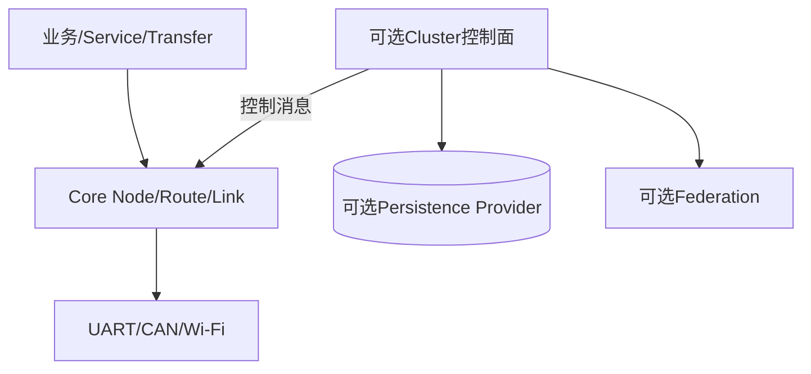

# Cluster 与 Core 的关系和适用场景

> 文档级别：`NORMATIVE`
> 实现状态：`PARTIAL（Current 与默认关闭实验层级见正文）`
> 适用版本：UCN 5.0.0 / Core Wire v5
> 事实源：Cluster 公共头、生产源码、独立 Archive、CMake 与测试
> 最近核对：`codex/v5-adaptive-wire@a093862`，2026-08-25
> 硬件状态：部分 ESP32-S3 实测；v4/掉电/完整多 Bearer 未发布验收

## 定位

Core 负责“帧如何从源节点到目标节点”；Cluster 负责“较大网络中谁属于哪个控制域、谁可以宣告控制权、配置如何受控变化”。二者是分层协作，不是两套互相替代的网络协议。

```text
业务任务 / Service / Transfer
            |
Core：Node、Endpoint、Route、Path、Link、Adapter
            |
可选 Cluster：Membership、Head/Backup、Authority、Config、Recovery
```

## 适合启用 Cluster 的场景

- 节点数增长后，需要把控制面限制在局部簇内；
- 需要 Head/Backup 角色和多数派约束；
- 需要受控配置变更、故障恢复或跨簇目录；
- 产品能够承担额外 RAM、控制流量、持久化和测试成本。

## 不必启用的场景

- 少量 MCU 只需自动发现、寻路和端到端收发；
- 系统没有可靠持久化介质，却要求严格的掉电一致性；
- 只需要本机任务通信、固定拓扑或简单点到点链路。

Cluster 是可选组件。禁用 Cluster 不会取消 Core 的多 Bearer、自动路由、固定路径、Transfer 或 Service 能力。

## 边界

当前仓库同时包含默认 Current FSM 与若干 Target/Archive 组件。集成者必须从 CMake target 和 Feature 开关判断实际链接内容，不能仅凭头文件存在就认定功能已启用。

## Core 与 Cluster 的实际调用关系

Cluster 使用 Core 已有能力发送控制 Endpoint/Frame、观察 Neighbor 和单调时间；Core 普通数据转发不需要查询 Cluster Head。即使 Cluster 进入 DETACHED/FENCED，产品仍可按策略让普通 Core Route/Service 继续工作。



Cluster 不能直接打开 Driver、修改物理 GPIO 或替业务解密 Payload；Federation 位于 Cluster 之上，也不替换 Core Link。

## 一个小网络为什么不需要 Cluster

4 个 MCU 组成 A→B→C 加一个旁路 Wi-Fi：Core 已能发现 Neighbor、按 Node ID 寻路、选 UART/CAN/Wi-Fi、用 Endpoint 区分任务。若没有“多数派谁有权改配置/当控制头”的需求，引入 Cluster 只会增加成员表、心跳、持久化和故障状态。

## 一个需要 Cluster 的例子

32 个执行/传感节点需要：

- 只有当前 Head 能发布配置；
- Backup 保持完整成员镜像；
- Head 失联后必须由 Voter 多数派而非任意节点接管；
- 网络分区后不能出现两个都认为自己有 Authority 的控制头；
- 两个局部组重新连通后受控合并。

此时 Cluster 提供控制域模型，普通 IMU/命令数据仍通过 Core Route/Endpoint 发送。

## 启用 Cluster 带来的成本

| 成本 | 来源 |
| --- | --- |
| RAM | Cluster 对象、成员/Voter/Snapshot/事务/目录固定表 |
| Flash | Cluster archive 与可选实验模块 |
| 控制带宽 | Advertise、Join、Keepalive、Snapshot、Vote、Recovery |
| 持久化 | Epoch/Vote/Config/Rekey 的 persist-before-promise |
| 时延 | 观察窗、选举、quorum、grace、同步与恢复 |
| 验证 | 分区、掉电、多 Bearer、恶意/陈旧控制帧 |

簇头选举需要观察/退避时间，是为了减少多个节点同时建立冲突 Authority，不是因为普通业务每次都等待选举。

## 断开 Head 时发生什么

默认 Current 与 Target 模型的具体行为不同，但安全目标一致：先通过 Lease/Link/Authority preflight 撤销旧 Head 的副作用，再由 Recovery/Takeover 等被当前版本允许的路径恢复。不能因为某 Backup “看起来在线”就跳过 durable vote/quorum。

恢复速度由 Heartbeat/Lease、Driver 硬故障通知、Backup 同步完整度、quorum 和持久化共同决定；不能给一个脱离配置/硬件的固定毫秒值。

## 集成决策

1. 先验证 Core 多跳/Service/Transfer；
2. 写出哪些操作必须由单一 Authority 控制；
3. 确认有可靠持久化和安全身份；
4. 选择只用 Current v3，还是参与尚受阻断的 Target 实验；
5. 计算对象、控制带宽和恢复预算；
6. 按发布门禁做多节点/掉电/分区验证。

若第 2 步没有明确答案，应优先不启用 Cluster。

## 事实检查表

- [ ] 普通 Core 与 Cluster Feature 可独立构建/链接；
- [ ] 应用没有把 Cluster Head 当作所有业务必经网关；
- [ ] 产品明确需要哪种 Authority；
- [ ] Persistence/Security/时钟前提成立；
- [ ] 使用的 Current/Archive/实验层级写入产品配置；
- [ ] 发布表述没有把 Host 模型扩大为实机生产能力。
