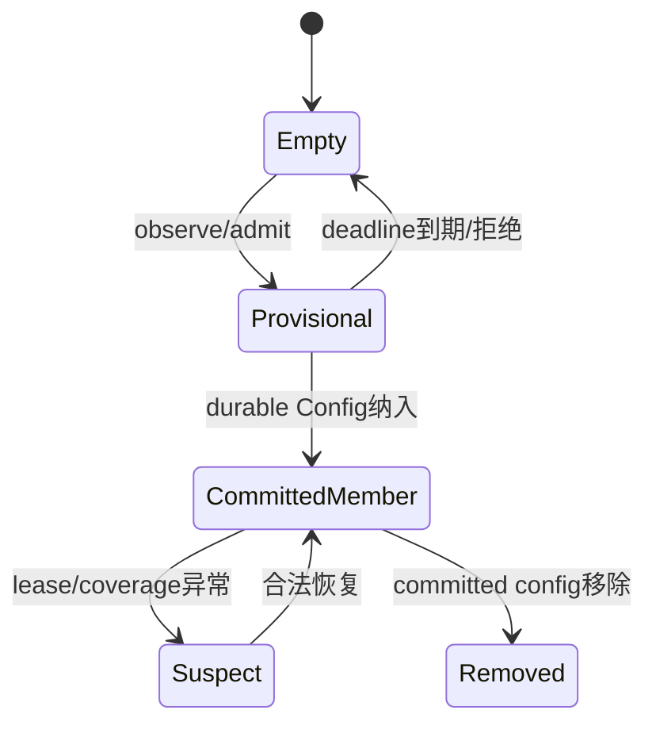

# Membership、Provisional 与 Committed VoterSet

> 文档级别：`NORMATIVE`
> 实现状态：`PARTIAL（Current 与默认关闭实验层级见正文）`
> 适用版本：UCN 5.0.0 / Core Wire v5
> 事实源：Cluster 公共头、生产源码、独立 Archive、CMake 与测试
> 最近核对：`codex/v5-adaptive-wire@a093862`，2026-08-25
> 硬件状态：部分 ESP32-S3 实测；v4/掉电/完整多 Bearer 未发布验收

## 三个不同概念

- Membership record：节点身份、状态、Wire/Capability 等成员元数据；
- Provisional：已观察或已准入但尚无投票权的临时成员；
- Committed VoterSet：由已提交 Config 冻结、可以计算 quorum 的投票集合。

“在成员表中”不等于“有投票权”，更不等于“可以成为 Backup”。

## 成员状态

成员模型使用固定容量记录和显式状态转换。空槽必须 canonical；非法 Node ID、非法状态组合、v3 capability 伪造和未提交成员进入 voter 集合都应拒绝。

## Provisional deadline

Provisional 成员有有界期限，过期后回收；续期和晋升只能来自符合当前协议策略的事件。它不参与 Voter quorum、Backup 资格或 Authority 计算。

## VoterSet

VoterSet 需要确定性排序、无重复、合法 Node ID 和固定 Config 引用。Stable 使用一个 voter set；Joint 同时保留 `C_old` 与 `C_new`，两个集合分别满足 quorum 才能提交切换。

## Legacy 边界

当前 v3 兼容成员可由 legacy bridge 建立为 `COMMITTED + voting + v3` 的历史元数据，但生产 v3 Backup/Takeover 权威帧已有入口围栏。该桥是迁移/测试边界，不是允许 v3 绕过 v4 资格模型。

## Membership record 保存什么

成员记录不仅有 Node ID，还可包含成员状态、Wire format/capability、snapshot/lease 相关元数据。所有 optional 字段在无效时必须 canonical 清零，避免两个语义相同状态产生不同 CRC/比较结果。

空槽不是 `node_id=0` 就结束；其余位也必须为零/合法空状态，防止脏内存被诊断或持久层误判。

## Provisional 的完整生命周期

Provisional 只能表示“已看到/正在准入”，不能被计入 quorum、选为 Backup 或发送 Vote。仅收到 HELLO/Join 不能直接赋 voting=true。

## Committed VoterSet 的 canonical 化

VoterSet 由 Config 冻结，要求：合法非零非广播 Node ID、无重复、确定性排序、数量不超过固定上限，并绑定 Config ID/generation/digest。排序决定 certificate bitmap 的 bit 含义，所有实现必须一致。

Head 是否也占一个 voter bit 按冻结 Config 规则，而不是从当前 Role 临时猜测。

## Stable 与 Joint

Stable 只有一个集合 C；多数派通常按 `floor(N/2)+1`。Joint 同时保留 C_old/C_new：一个节点可属于一边或两边，但 quorum 必须分别在两份集合计算，不能把所有 vote 合并后只算一次多数。

## Wire/Capability 与资格

成员能接收普通 v4 Frame 不等于支持 Config/Takeover capability。资格要同时满足 frozen offer/capability、Build Feature、策略和动态状态。v3 legacy 在 Strict v4 下拒绝；显式 legacy 也只能是 non-voting 且 required bits=0。

## 容量和回收

成员表固定。Provisional 到期可回收；Committed/Voter 不能因新 Join 表满而被任意覆盖。满载应拒绝新准入并统计，让 Head/管理面决定扩容或移除，而不是破坏已有 quorum。

## 验证清单

- [ ] 空槽/缺省字段 canonical；
- [ ] Provisional 永不进入 voter/Backup/Authority；
- [ ] 过期后回收，非法续期不延长；
- [ ] VoterSet 排序/去重/bitmap 顺序稳定；
- [ ] Joint 双集合分别 quorum；
- [ ] v3 capability/role 不能伪造 v4 资格；
- [ ] 表满不覆盖 committed voter。
