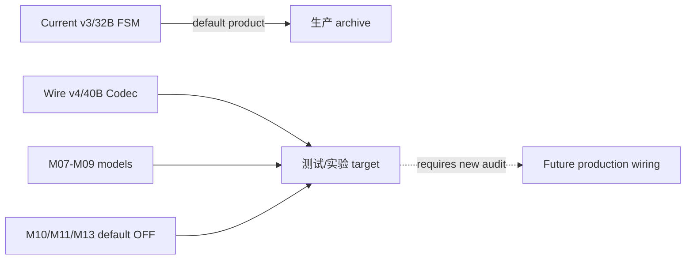

# Cluster Current 与 Target 状态图

```mermaid
flowchart LR
  C[Current v3/32B FSM] -->|default product| P[生产 archive]
  V4[Wire v4/40B Codec] --> T[测试/实验 target]
  M7[M07-M09 models] --> T
  M10[M10/M11/M13 default OFF] --> T
  T -. requires new audit .-> F[Future production wiring]
```
