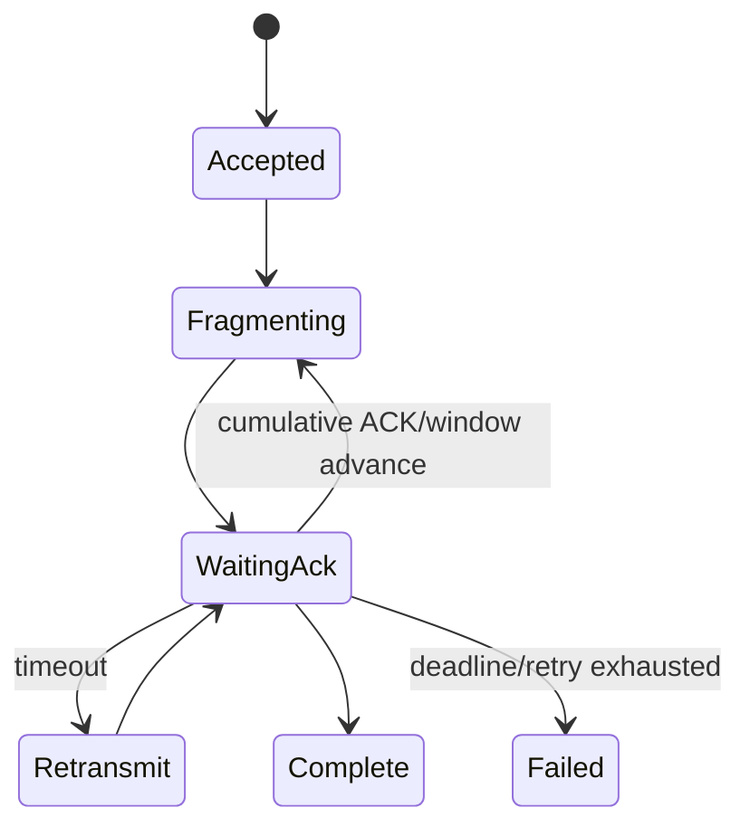

# Transfer 状态图

```mermaid
stateDiagram-v2
  [*] --> Accepted
  Accepted --> Fragmenting
  Fragmenting --> WaitingAck
  WaitingAck --> Fragmenting: cumulative ACK/window advance
  WaitingAck --> Retransmit: timeout
  Retransmit --> WaitingAck
  WaitingAck --> Complete
  WaitingAck --> Failed: deadline/retry exhausted
```
