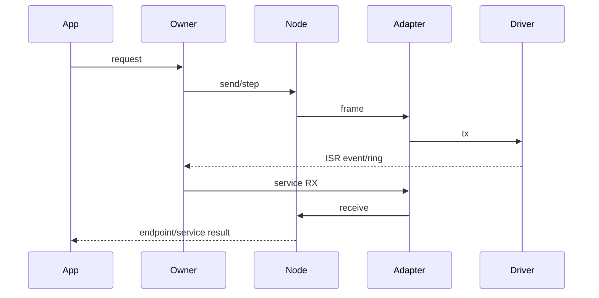

# 发送接收时序图

```mermaid
sequenceDiagram
  participant App
  participant Owner
  participant Node
  participant Adapter
  participant Driver
  App->>Owner: request
  Owner->>Node: send/step
  Node->>Adapter: frame
  Adapter->>Driver: tx
  Driver-->>Owner: ISR event/ring
  Owner->>Adapter: service RX
  Adapter->>Node: receive
  Node-->>App: endpoint/service result
```
