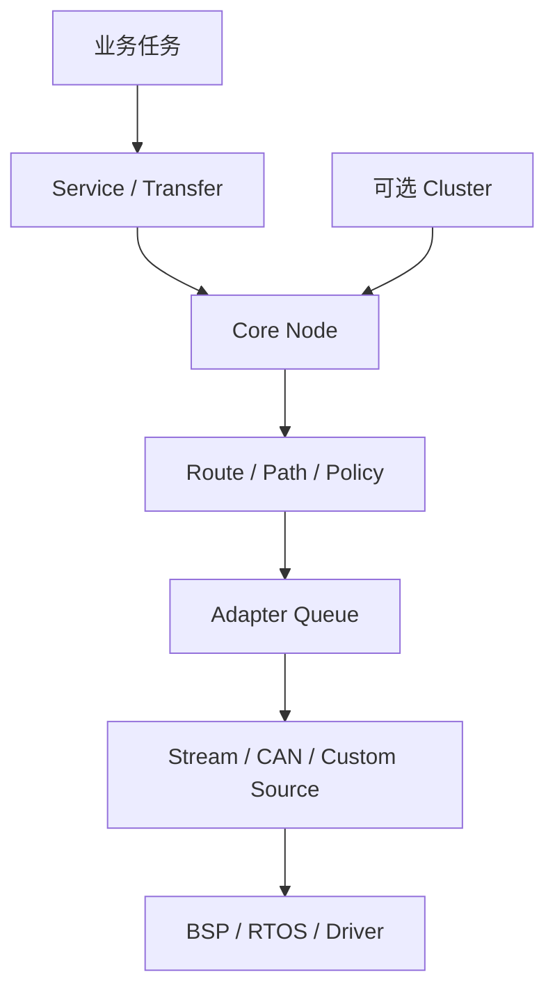

# 总体架构图

```mermaid
flowchart TB
  APP[业务任务] --> SRV[Service / Transfer]
  SRV --> NODE[Core Node]
  CL[可选 Cluster] --> NODE
  NODE --> R[Route / Path / Policy]
  R --> A[Adapter Queue]
  A --> S[Stream / CAN / Custom Source]
  S --> BSP[BSP / RTOS / Driver]
```
