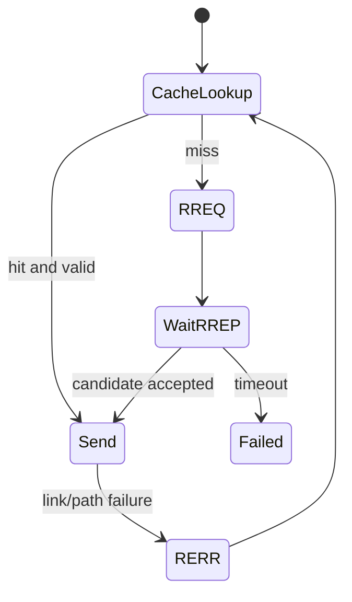

# 路由发现状态图

```mermaid
stateDiagram-v2
  [*] --> CacheLookup
  CacheLookup --> Send: hit and valid
  CacheLookup --> RREQ: miss
  RREQ --> WaitRREP
  WaitRREP --> Send: candidate accepted
  WaitRREP --> Failed: timeout
  Send --> RERR: link/path failure
  RERR --> CacheLookup
```
