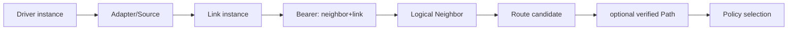

# Link、Bearer、Neighbor、Route 与 Path 关系

> 文档级别：`NORMATIVE`
> 实现状态：`CURRENT`
> 最近核对：`a093862`，2026-08-25

| 对象 | 回答的问题 | 生命周期 |
| --- | --- | --- |
| Link | 通过哪个本地接口发送？ | 产品注册；有 open/up/down/MTU/metrics |
| Bearer | 同一邻居经哪条物理通道直连？ | HELLO/Heartbeat 独立维护 |
| Neighbor | 哪个 Node 与本节点一跳可达？ | 多 Bearer 合并为一个逻辑身份 |
| Route | 去目标 Node 的下一跳/Link 是什么？ | 自动发现或直连生成，有时效 |
| Candidate | 同一目标还有哪些可替换路线？ | Full 有界缓存，按质量更新 |
| Path | 一个显式端到端转发身份和每跳表项 | 受授权安装/撤销，独立于 Route Cache |
| Policy | 某目标+Endpoint+Traffic Class 应如何选 Path？ | Full 固定表配置 |

## 多接口节点

一个节点可以注册 UART1、UART2、CAN1、CAN2、Wi-Fi 等多个 Link。每个实例具有独立 local link ID、Driver context、MTU、基础 Cost、Metrics 和状态。

若 UART 和 Wi-Fi 都直连同一个 Node ID，它们成为同一 Neighbor 的两个 Bearer。Primary Bearer 可变化，但 Neighbor 逻辑身份不变。

## Route 与完整路径

普通 Route 只需要保存“目标→下一跳/Link”，中间节点逐跳做相同判断，因此不要求每个节点知道完整 A→B→C→D 列表。

Full 的 Path Trace 是按需诊断，显式 Path 是受控转发机制。它们不是每次普通数据发送前都执行一次全路径查询。

## 介质并行

不同 Link 可以在硬件和 Driver 层并行收发；同一个 Node 的协议状态仍由唯一 Owner 串行推进。并行 Link 不等于两个线程可以同时修改 Route/Neighbor 表。

## 对象如何一层层建立

产品首先创建 Driver/Adapter，再把一个 `ucn_link_t` 注册给 Node。Link 获得本地 `link_id`、发送回调、MTU、基础 Cost 和 up/down 状态。只有 Link 收到并通过准入的 HELLO 后，Node 才能把“某个远端 Node 可通过这条 Link 一跳到达”记录为 Bearer。

同一个 Driver 可以对应多个物理 peer，但每个能被独立定价、独立判活或独立发送的出口必须在产品 Adapter 中形成可区分的 Link/Bearer 身份。反过来，两条不同 Link 发现同一远端 Node ID 时，不能创建两个逻辑 Node；它们是同一 Neighbor 的两个 Bearer。

## 每个对象由谁更新

| 对象 | 创建/配置者 | 运行时更新来源 | 失效动作 |
| --- | --- | --- | --- |
| Link | 产品初始化代码 | Driver 状态、Metrics、send 结果 | 标 Down，停止选择 |
| Bearer | Node 根据直连 HELLO 建立 | Heartbeat、Link/peer 活性 | 从 Neighbor 的可用 Bearer 中移除 |
| Neighbor | Node 合并同 Node ID 的 Bearer | 准入、租约、Profile 能力 | 失去全部 Bearer 后离线 |
| Route | 静态配置、直连学习或 AODV | RREP、Candidate、RERR、Deadline | 删除/降级并触发发现或报错 |
| Path | 受权 Path Control | install/revoke/capability | 撤销逐跳表项并通知 Policy |
| Policy | 产品配置/API | Path 可用性、Flow/Cost | 按模式失败或回退 |

应用只能通过公开 API/只读诊断观察这些状态，不应直接改内部表，否则会绕过容量、授权和原子性检查。

## 一个多 Bearer 示例

节点 A 同时通过 UART 和 Wi-Fi 直连节点 B：

1. 产品注册 `uart_link` 和 `wifi_link`；
2. 两条 Link 都收到来自 Node B 的 HELLO；
3. Neighbor 表只有一个 B，但 Bearer 列表有 UART/B 与 Wi-Fi/B；
4. Auto Best 根据两条 Bearer 当前可选 Cost 选择出口；
5. Wi-Fi 质量下降但仍可用时，滞回决定是否切到 UART；
6. Wi-Fi 硬 Down 时立即撤销该 Bearer，B 仍因 UART 存在而保持在线；
7. UART 也超时后，B 才成为不可直连，依赖它的 Route/Path 被撤销。

这就是“网络身份不随通信方式变化”的具体含义。

## Route 与 Path 为什么同时存在

Route 是自动网络可达性的缓存，适合大多数普通发送；Path 是显式、可授权、带身份和能力约束的逐跳转发状态。两者不能简单合并：

- Route 可以因 AODV 发现和质量变化自动替换；
- Pinned Path 需要按产品意图保持固定，直到硬失败或显式撤销；
- Route key 主要围绕 Destination；Policy key 还包含 Endpoint 和 Traffic Class；
- Path ID 可进入安全 AAD，而普通 Route 的本地下一个 Link 不应变成端到端业务身份。

## 常见误解

- **Link 等于 UART/CAN 类型**：错误。Link 是一个实例；UART1 和 UART2 是两条 Link。
- **Neighbor 等于当前首选 Link**：错误。Neighbor 是逻辑 Node，可同时拥有多 Bearer。
- **Route 保存完整路径**：错误。普通 Route 主要保存本地下一跳；完整路径只在按需 Trace 中返回。
- **Path 是更优 Route**：错误。Path 是显式转发身份，可因业务约束选择一个并非最低 Cost 的介质。
- **多 Link 自动等于并行协议线程**：错误。物理可并行，Core 状态仍由唯一 Owner 推进。

## 产品检查表

- [ ] 每个物理接口实例有独立 Link ID、MTU、Cost、Metrics 和 context；
- [ ] 同 Node ID 的多 Link 被合并为一个 Neighbor、多 Bearer；
- [ ] Link/Bearer/Neighbor 的 down 判据没有混为一谈；
- [ ] 业务使用 Route 还是显式 Path 有明确理由；
- [ ] Policy 只引用已经验证的本地 Path handle；
- [ ] ISR/Driver 不直接修改 Neighbor、Route 或 Path 表。
