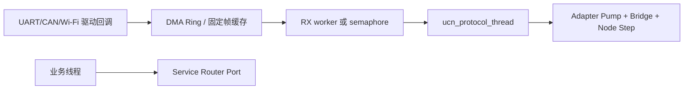

# UCN Zephyr 快速使用

> 适用：Zephyr 应用。当前仓库没有 Zephyr 专用 Port；本页将 UCN C99 Core 放进 Zephyr 线程、驱动回调和静态内核对象中。不要把本文称作“已合入的 Zephyr 驱动”。

## 1. 加入 Zephyr 应用构建

在应用 `CMakeLists.txt` 中把 UCN 的九个 C99 源文件作为应用源，并添加仓库 `include/`。路径按你的仓库摆放调整：

```cmake
set(UCN_DIR ${CMAKE_CURRENT_SOURCE_DIR}/../UCN)

target_sources(app PRIVATE
  ${UCN_DIR}/src/ucn_core.c
  ${UCN_DIR}/src/ucn_adapter.c
  ${UCN_DIR}/src/ucn_endpoint.c
  ${UCN_DIR}/src/ucn_frame.c
  ${UCN_DIR}/src/ucn_node.c
  ${UCN_DIR}/src/ucn_path.c
  ${UCN_DIR}/src/ucn_policy.c
  ${UCN_DIR}/src/ucn_service.c
  ${UCN_DIR}/src/ucn_service_bridge.c)
target_include_directories(app PRIVATE ${UCN_DIR}/include)
```

`prj.conf` 只需为你的 Protocol Thread、驱动与日志设置资源。以下是起点而非通用 RAM 承诺：

```ini
CONFIG_MAIN_STACK_SIZE=2048
CONFIG_ASSERT=y
CONFIG_LOG=y
```

UCN 没有现成的 Kconfig 符号；建议在你的应用 Kconfig 建立 `CONFIG_APP_UCN_*`，统一导出为 `UCN_MAX_FRAME_BYTES`、各固定表深度和线程栈大小。不要改 UCN Core 源文件来绑定某一个板子。

## 2. 线程与驱动模型



驱动 callback 可能运行在中断上下文，不能锁 `k_mutex`、不能调用 Node。用驱动自己的 DMA ring、`ring_buf` 或固定 RX worker 形成完整 UCN 帧；Protocol Thread 单独取出帧并调用 `ucn_adapter_rx_enqueue()`。这样 Adapter Queue 不被并发访问，可用 `ucn_adapter_rx_queue_init(&queue, NULL, NULL)`。

## 3. 静态 Protocol Thread

在线程启动前完成 Node 配置：`ucn_node_init()` 后调用 `ucn_node_set_wire_profiles()`，再按产品需要显式开启自动最小档，随后注册 Link 和 Security Provider。建议把固定 TX/最大 RX 档映射为产品 Kconfig 常量，但仍只调用官方 W0～W3 API，不自定义位宽。

```c
#include <zephyr/kernel.h>
#include "ucn/ucn_adapter.h"
#include "ucn/ucn_node_storage.h"

K_THREAD_STACK_DEFINE(g_ucn_stack, CONFIG_APP_UCN_PROTOCOL_STACK_SIZE);
static struct k_thread g_ucn_thread;
static ucn_node_t g_node;
static ucn_adapter_rx_queue_t g_rx_queue;

static void ucn_protocol_thread(void *a, void *b, void *c)
{
    ARG_UNUSED(a); ARG_UNUSED(b); ARG_UNUSED(c);
    for (;;) {
        size_t pumped = 0U;
        uint8_t sent = 0U;

        app_driver_drain_complete_frames();
        (void)ucn_adapter_rx_pump(&g_rx_queue, &g_node, 4U, &pumped);
        (void)ucn_service_protocol_bridge_step(&g_bridge, 2U, &sent);
        (void)ucn_node_step(&g_node, k_uptime_get_32());
        k_sleep(K_MSEC(1));
    }
}

void app_start_ucn(void)
{
    k_thread_create(&g_ucn_thread, g_ucn_stack, K_THREAD_STACK_SIZEOF(g_ucn_stack),
        ucn_protocol_thread, NULL, NULL, NULL, 5, 0, K_NO_WAIT);
}
```

用实际 Heartbeat、Route 超时与发送负载决定休眠时间或改用信号唤醒；但必须保证周期执行 `ucn_node_step()`，不能只在有 RX 时运行。

## 4. Service Router 的 Zephyr 适配原则

Zephyr Port 需要三个静态对象：一个 `k_mutex` 保护 Router 短拷贝、每个业务消费者一个有界 Endpoint 通知对象、一个 Consumer 到 `k_tid_t` 的固定绑定表。通过 `ucn_service_protocol_bridge_set_inbound_hooks()` 把 Router lock/unlock 和“远端 Endpoint 已投递”通知交给 Bridge。

- `k_mutex` 仅由线程使用；ISR 只能写驱动缓冲并发信号。
- 通知对象只存 Endpoint 或计数，不能存第二份大 Payload；业务线程唤醒后循环 `ucn_service_inbox_take()`。
- 每个 Endpoint 只有一个 Router owner；用 `k_current_get()` 与绑定表拒绝错误线程读取 Inbox。
- Protocol Thread 必须在同一把 Router 锁下运行 Bridge Step，Hooks 已覆盖 Bridge 的取 Remote TX 和入站投递。

## 5. Link 与设备树边界

将 UART、CAN、SPI 无线模块的设备树选择和 Zephyr 驱动 API 放在产品 Adapter 中。Adapter 的 `send()` 把 Core 帧提交给该设备；`get_status()` 反映驱动真实 Up/Down；`get_metrics()` 生成介质无关 Cost。一个对端可有多个 Link（如 UART + Wi-Fi），但保持一个 `peer_node_id`。

经典 CAN 小 MTU 的分段/重组 Carrier 并不由当前 UCN Core 自动提供；若选 CAN，先实现并单测自己的 Adapter 载体层，再让它向 UCN 交付完整帧。

## 6. 最小验收

1. 在 `native_sim` 或目标板构建通过，再以单 Link、两个 Node、Q1 Endpoint 验证收发。
2. 驱动 RX ring 满时必须显式丢弃/计数，Protocol Thread 不得堆积或阻塞。
3. 加入 Service 后验证本机 Fast Path、远端 Bridge、Q0/Q1 语义和线程所有权。
4. 记录 `k_thread_stack_space_get()`、队列高水位、Link 错误与 Node/Router/Bridge 统计；完成后再接安全 Provider、Path 和负载均衡。

## 7. S16 Protocol Thread 时限

用 Kconfig/Product Profile 冻结 `UCN_MAX_STEP_INTERVAL_MS`、线程优先级、最大 `k_poll()`/`k_sleep()` 超时、RX Pump/Bridge 预算与 Link `send()` WCET。线程必须周期唤醒，不能只等业务事件。压力测试记录 `max_step_gap_ms`、`step_interval_violations` 和 Heartbeat/Probe 延迟；仓库当前没有 Zephyr Port 实测结果。
