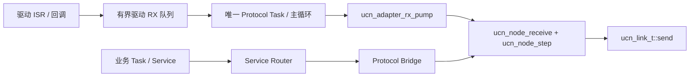

# UCN 快速使用手册

> 适用：当前 UCN Core 4.0.0 / 线协议 v4。本文档组以 `include/ucn/` 的公开 C99 API 和现有 ESP32 FreeRTOS 参考实现为准。

## 选择你的运行环境

| 环境 | 文档 | 当前仓库状态 | 适合场景 |
| --- | --- | --- | --- |
| 裸机 / Super Loop | [01-裸机快速使用](01-裸机快速使用.md) | Core 直接可用；需实现板级 Link/Adapter。 | 一个主循环、低资源 MCU。 |
| 通用 RTOS | [02-通用RTOS快速使用](02-通用RTOS快速使用.md) | 提供平台无关 Router/Bridge API；需自行做 OS 适配层。 | 自研 RTOS 或希望先统一任务模型。 |
| FreeRTOS | [03-FreeRTOS快速使用](03-FreeRTOS快速使用.md) | ESP32 测试工程已有静态 Port 参考。 | ESP32 或其他 FreeRTOS MCU。 |
| Zephyr | [04-Zephyr快速使用](04-Zephyr快速使用.md) | 尚无 Zephyr Port；按本文接入。 | Zephyr 应用、设备树驱动和线程模型。 |
| NuttX | [05-NuttX快速使用](05-NuttX快速使用.md) | 尚无 NuttX Port；按本文接入。 | NuttX/PX4 风格的板级应用。 |
| RT-Thread | [06-RT-Thread快速使用](06-RT-Thread快速使用.md) | 尚无 RT-Thread Port；按本文接入。 | RT-Thread BSP 与设备框架。 |

“已有参考”不等于已经替你的板子完成驱动、引脚、DMA、密钥或实机验收。UCN Core 不包含 Wi-Fi、CAN、UART、BLE、LoRa 的具体驱动；每个产品仍要实现自己的 Link/Adapter。

## 所有平台必须保持的边界



1. 一个 MCU 只有一个 `ucn_node_t`，并且只由一个 Protocol Task（或裸机主循环）调用 `ucn_node_receive()`、`ucn_node_step()`、`ucn_node_send_endpoint()`。
2. ISR、DMA 回调、Wi-Fi/BLE 回调只能把完整 UCN 帧放进**有上限**的驱动队列；不能运行路由、解密、Endpoint handler 或业务回调。
3. `ucn_link_t` 只处理一种实际传输介质。它报告 `is_up`、MTU 和通用质量 Cost；业务代码不传 MAC、UART 号、CAN ID 或中继地址。
4. 多个本机业务任务使用 `ucn_service_router_t`：本机消息进入固定 Inbox，远端消息经 `ucn_service_protocol_bridge_t` 由 Protocol Task 发出。Router 中没有动态内存。
5. Q0 命令入队成功不等于执行器已经执行。Q0 必须有本机失效安全；Q1 是 Latest Value，允许覆盖旧传感器值。
6. 生产安全节点使用 Lite/Full，并定义 `UCN_SECURITY_REQUIRED_BY_DEFAULT=1` 或启动时调用 `ucn_node_set_security_required(..., true)`；只有 `ucn_node_security_ready()` 为真才进入协议循环。测试 Provider 不能替代生产 AEAD。
7. Service Binding 是 Router 借用的只读表，必须使用全生命周期有效的存储，推荐 `static const`，不能传函数栈上的临时数组。

## 共同的最小构建输入

将以下 C99 源文件加入目标（或以 CMake `add_subdirectory()` 引入本仓库并关闭 `UCN_BUILD_TESTS`）：

```text
src/ucn_core.c
src/ucn_adapter.c
src/ucn_endpoint.c
src/ucn_frame.c
src/ucn_node.c
src/ucn_path.c
src/ucn_policy.c
src/ucn_service.c
src/ucn_service_bridge.c
include/ucn/
```

编译器使用 C99；没有 `malloc` 依赖。资源上限通过宏在构建时冻结，例如 `UCN_MAX_FRAME_BYTES`、`UCN_MAX_LINKS`、`UCN_MAX_NEIGHBORS`、`UCN_MAX_ROUTES`、`UCN_TX_Q0_DEPTH`、`UCN_TX_Q1_DEPTH`、`UCN_ADAPTER_RX_QUEUE_DEPTH` 和 `UCN_SERVICE_*`。先按最小节点测量 RAM/Flash/栈，再增加上限；不要在运行时无界扩容。

## 先完成这四项，再让业务入网

1. 冻结 `network_id`、每块板稳定且不重复的 `node_id`、Endpoint ABI、QoS 和最大 Payload。
2. 实现至少一种 Link 的 `open/send/poll_rx/get_status/close/get_metrics`，并把它注册到 Node。
3. 让完整帧遵守“驱动队列 → Protocol Task → `ucn_adapter_rx_pump()`”路径；验证队列满会丢弃并计数，不会卡死回调。
4. 先以一个 Endpoint 的 Q1 数据做两节点收发，再接 Service Router、多 Bearer、Path、策略和安全 Provider。

常用详细资料：[UCN 使用与调用手册](../UCN_使用与调用手册.md)、[Adapter 契约](../UCN_Adapter_契约.md)、[调用关系树](../calltree/README.md)。
