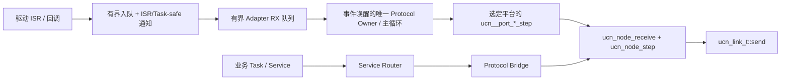

# UCN 快速使用手册

> 适用：当前 `codex/v5-adaptive-wire` 的 UCN Core 5.0.0 / 线协议 v5。默认固定 W3；固定域、显式自动最小档、Profile-aware 控制面、动态 MTU、逻辑 Bearer Policy、标准多 Source Event Runtime、公共 Stream Source、CAN/CAN-FD Frame Source、独立兼容平台 Port 和可选 T32～T8K Transfer 已可用。本文档组以当前公开 C99 API 和 CMake 源文件选择为准；生产安全和真实 Driver/多板/多介质性能仍未由本手册替代验证。

> V5-62 迁移门禁：预发布版本已允许破坏性工程 API 更新。所有 `ucn_port_ops_t` 必须具名填写 `struct_size/api_version`，所有 Transfer 配置必须提供权威 `now_ms` 回调，`ucn_transfer_step()` 不再接收时间参数。Wire 仍为 v5，但旧对象不得与新头文件混用；升级后必须清空构建产物并全量重编译。详见 [V5-62 修复报告](../UCN_V5_62_Port_API_V2与审计缺陷修复报告.md)。

## 选择你的运行环境

| 环境 | 文档 | 当前仓库状态 | 适合场景 |
| --- | --- | --- | --- |
| 裸机 / Super Loop | [01-裸机快速使用](01-裸机快速使用.md) | Core 直接可用；需实现板级 Link/Adapter。 | 一个主循环、低资源 MCU。 |
| 通用 RTOS | [02-通用RTOS快速使用](02-通用RTOS快速使用.md) | 提供平台无关 Router/Bridge API；需自行做 OS 适配层。 | 自研 RTOS 或希望先统一任务模型。 |
| FreeRTOS | [03-FreeRTOS快速使用](03-FreeRTOS快速使用.md) | 已有独立 C99 Port 入口；ESP32 v5 Adapter/实机仍待 V5-38。 | ESP32 或其他 FreeRTOS MCU。 |
| Zephyr | [04-Zephyr快速使用](04-Zephyr快速使用.md) | 已有独立 C99 Port 入口；Zephyr SDK glue 仍由产品提供。 | Zephyr 应用、设备树驱动和线程模型。 |
| NuttX | [05-NuttX快速使用](05-NuttX快速使用.md) | 已有独立 C99 Port 入口；NuttX SDK glue 仍由产品提供。 | NuttX/PX4 风格的板级应用。 |
| RT-Thread | [06-RT-Thread快速使用](06-RT-Thread快速使用.md) | 已有独立 C99 Port 入口；RT-Thread 不再借用其它 RTOS 模式。 | RT-Thread BSP 与设备框架。 |

“已有参考”不等于已经替你的板子完成驱动、引脚、DMA、密钥或实机验收。UCN Core 不包含 Wi-Fi、CAN、UART、BLE、LoRa 的具体驱动；每个产品仍要实现自己的 Link/Adapter。当前可以先用 `ucn_standard_adapter.h` 解析官方静态 Preset/Cost/MTU，再把结果绑定到产品 Adapter；该 Resolver 不初始化硬件、不注册 Link、也不做动态选路。

## 先选择 Build Profile

Build Profile 决定实际编译的状态机和对象布局；Wire Profile 只决定帧字段宽度，两者不能混为一谈。

| Build Profile | 当前能力 | 不具备的高级能力 |
| --- | --- | --- |
| Nano | 静态 Link/Route、Endpoint、Q0/Q1、W0～W3 编解码。 | 动态 Mesh、Security、Candidate、Path、Policy、诊断。 |
| Lite | Nano 基础能力、动态 Mesh、Security。 | Candidate、Path、Policy、诊断。 |
| Full | 动态 Mesh、Security、Candidate、Path、Policy、诊断。 | 生产密码、真实 Carrier 与产品授权仍由外部实现。 |

`UCN_FEATURE_SERVICE` 与三档正交：开启才编译 Service Router/Bridge。所有包含 UCN 公共头的编译单元必须看到完全相同的 `UCN_PROFILE`、`UCN_FEATURE_SERVICE` 和产品配置头，否则公开对象布局不一致。

消息大小能力同样与三档 Build Profile 正交：只有产品链接 `ucn_transfer` 并静态创建 `ucn_transfer_t` 才支付大消息资源。普通节点继续只链接 `ucn_core`；中继能透明转发 Fragment，不需要 8 KiB 重组 Buffer。

## 所有平台必须保持的边界



1. 一个 MCU 只有一个 `ucn_node_t`，并且只由一个 Protocol Task（或裸机主循环）调用 `ucn_node_receive()`、`ucn_node_step()`、`ucn_node_send_endpoint()`。
2. UART/RS-485/USB CDC 的 ISR、DMA 回调把整块字节交给 `ucn_stream_source_write_from_isr()`；CAN/CAN-FD 把规范化物理帧交给 `ucn_can_source_write_from_isr()`；其他 Bearer 写各自有界 Ring 后通知 Event Runtime。任何 ISR 都不能运行路由、解密、Endpoint handler 或业务回调。RTOS/现代 MCU 以事件通知为正常路径，轮询只用于无中断平台和最大 Step 间隔兜底，正常数据不等待 Heartbeat。
3. V5-58 新多 Bearer 产品使用公共 `ucn_event_runtime_t`：Source ID 静态注册，Task/ISR 事件按位合并，Owner 按 Source/Round 固定预算 Drain；FreeRTOS、Zephyr、NuttX、RT-Thread 只实现相同的 notify/wait/yield Hook，裸机可省略 Hook。V5-48 的独立 Platform Port 继续作为单 Queue 兼容入口。两条路径都不创建 RTOS SDK 对象或驱动；ISR 直入完整帧仅在产品提供成对 ISR token 临界区时允许，BSP Ring→Protocol Task 仍是首选。
4. 多个本机业务任务使用 `ucn_service_router_t`：本机消息进入固定 Inbox，远端消息经 `ucn_service_protocol_bridge_t` 由 Protocol Task 发出。Router 中没有动态内存。
5. Q0 命令入队成功不等于执行器已经执行。Q0 必须有本机失效安全；Q1 是 Latest Value，允许覆盖旧传感器值。
6. 生产安全节点使用 Lite/Full，并定义 `UCN_SECURITY_REQUIRED_BY_DEFAULT=1` 或启动时调用 `ucn_node_set_security_required(..., true)`；只有 `ucn_node_security_ready()` 为真才进入协议循环。明文开发节点也应在联网前设置非零、重启不复用的 Boot Session。测试 Provider 不能替代生产 AEAD。
7. Service Binding 是 Router 借用的只读表，必须使用全生命周期有效的存储，推荐 `static const`，不能传函数栈上的临时数组。

## 共同的构建输入

优先使用仓库 CMake，让同一套规则选择 Profile 源文件并向使用者导出对象布局宏：

```cmake
set(UCN_DIR "${CMAKE_CURRENT_LIST_DIR}/path/to/UCN")
set(UCN_BUILD_TESTS OFF CACHE BOOL "" FORCE)
set(UCN_BUILD_SCALE_SIM OFF CACHE BOOL "" FORCE)
set(UCN_BUILD_CONFIG_CONTRACT_TESTS OFF CACHE BOOL "" FORCE)
set(UCN_PROFILE LITE CACHE STRING "" FORCE)       # NANO / LITE / FULL
set(UCN_FEATURE_SERVICE ON CACHE BOOL "" FORCE)   # ON / OFF
add_subdirectory(${UCN_DIR} ${CMAKE_BINARY_DIR}/ucn)
target_link_libraries(your_target PRIVATE ucn_core ucn_port_freertos)
```

需要按需发送 T32～T8K 逻辑消息的端点，再额外链接 `ucn_transfer`；不要给所有中继默认添加：

```cmake
target_link_libraries(your_target PRIVATE ucn_transfer)
```

产品构建系统若必须直接添加 C99 源文件，使用下面的组合，不能固定复制“九个文件”：

| 组合 | 源文件 |
| --- | --- |
| 所有 Profile 公共 | `src/core/ucn_core.c`、`src/core/ucn_endpoint.c`、`src/core/ucn_frame.c`、`src/transport/ucn_adapter.c`、`src/transport/ucn_event_runtime.c`、`src/transport/ucn_standard_adapter.c`、`src/transport/ucn_protocol_owner.c` |
| 选择一个 Platform Port | 只加入与目标系统对应的 `src/ports/ucn_port_*.c`；CMake 目标为 `ucn_port_bare_metal`、`ucn_port_freertos`、`ucn_port_zephyr`、`ucn_port_nuttx`、`ucn_port_rtthread` 或 `ucn_port_host_fake`。 |
| Nano | `src/node/ucn_node_nano.c`、`src/node/ucn_profile_stubs.c` |
| Lite | `src/node/ucn_node.c`、`src/node/ucn_profile_stubs.c` |
| Full | `src/node/ucn_node.c`、`src/routing/ucn_path.c`、`src/routing/ucn_policy.c` |
| Service ON | 追加 `src/service/ucn_service.c`、`src/service/ucn_service_bridge.c` |
| Transfer ON（按需） | 追加 `src/extended/ucn_transfer.c`，并包含 `ucn/ucn_transfer.h`。 |

直接构建时还要全局定义同一组 `UCN_PROFILE=1/2/3`、`UCN_FEATURE_SERVICE=0/1`，并把 `include/` 加入头文件路径。Nano/Lite 的 Stub 是公开 API 符号合同的一部分，不能省略。

编译器使用 C99；没有 `malloc` 依赖。资源上限通过宏在构建时冻结，例如 `UCN_MAX_FRAME_BYTES`、`UCN_MAX_LINKS`、`UCN_MAX_NEIGHBORS`、`UCN_MAX_ROUTES`、`UCN_TX_Q0_DEPTH`、`UCN_TX_Q1_DEPTH`、`UCN_ADAPTER_RX_QUEUE_DEPTH` 和 `UCN_SERVICE_*`。先按最小节点测量 RAM/Flash/栈，再增加上限；不要在运行时无界扩容。

动态 MTU 的统一合同是：`link.mtu != 0` 表示静态上限，`get_status().mtu != 0` 表示当前运行期上限，两者同时存在时取较小值；`link.mtu=0` 可完全依赖运行期值。两者都为 0 时该 Link 暂不可发送并返回 `UCN_ERR_LINK_DOWN`，运行期 MTU 恢复后无需重新注册。这里的 MTU 是 Carrier 完成分段/重组后可承载的完整 UCN 逻辑帧上限。

## 先完成这四项，再让业务入网

1. 冻结 `network_id`、每块板稳定且不重复的 `node_id`、非零 Boot Session、最低够用 TX/默认 W3 RX Wire Profile、Endpoint ABI、QoS 和最大 Payload；Network/Node/Session/Hop 都必须能被固定 TX Profile 表达。编译期容量统一通过 `ucn_config.h`/产品 `UCN_USER_CONFIG_HEADER` 管理。
2. 可选：先用 `ucn_standard_link_config_resolve()` 取得 UART/CAN-FD/ESP-NOW/Wi-Fi/USB CDC 的静态 Cost/MTU/RTT 默认值；CAN-FD/ESP-NOW 必须显式请求不超过 64/250 B 的逻辑 MTU。再实现至少一种 Link 的 `open/send/poll_rx/get_status/close/get_metrics`，并把它注册到 Node。
3. 新产品让数据遵守“驱动 ISR/回调 → Bearer 固定 Ring → Event Runtime Source → Carrier 解出完整帧 → Adapter RX Queue → 公共 Owner”路径；兼容产品仍可用单 Queue `ucn_<platform>_port_*`。验证 Ring/Queue 满时有界背压/丢弃并计数，不会卡死回调；需要直接控制低层顺序时，才使用 `ucn_adapter_rx_pump()`/Bridge/`ucn_node_step()` 原始 API。
4. 先以一个 Endpoint 的 Q1 数据做两节点收发，再接 Service Router、多 Bearer、Path、策略和安全 Provider。Full 的 Path 安装仍要求认证 Session 和产品授权；旧 `ucn_node_send_path_install()` 固定发送 v5 基础格式，只有确认目标支持扩展 Schema 后才调用 `ucn_node_send_path_install_capable()`。Lite/Nano 的 Path API 仅保留可链接 Stub，并返回 `UCN_ERR_CONFIG`。

常用详细资料：[UCN 使用与调用手册](../UCN_使用与调用手册.md)、[Adapter 契约](../UCN_Adapter_契约.md)、[调用关系树](../calltree/README.md)。
